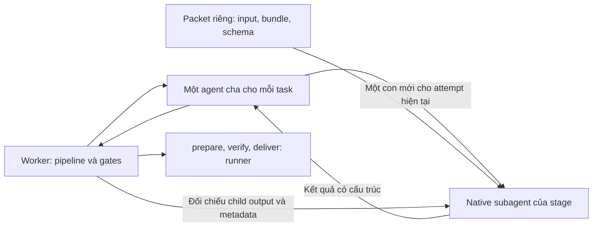

# Agent Harness

Công cụ chạy local để điều phối Codex trên repository Git: từ yêu cầu và kế hoạch được duyệt đến triển khai, kiểm thử, review và bàn giao.

Dashboard dùng Next.js; worker Node.js chạy độc lập và lưu trạng thái bằng SQLite.

## Tính năng

- Duyệt kế hoạch và phạm vi kiểm thử trước khi sửa code.
- Mỗi task có branch và worktree riêng; xử lý một task tại một thời điểm.
- Chọn model theo stage; agent profiles và skills đi kèm repository.
- Theo dõi tiến độ, diff, kết quả kiểm thử và review trên dashboard.
- Tạm dừng, tiếp tục và bàn giao bằng báo cáo local hoặc GitHub pull request.

## Mô hình agent cha và subagents

Trong Harness này:

- **Skill:** tài liệu hướng dẫn cách làm việc, được ghép vào context của stage.
- **Agent profile:** hướng dẫn vai trò, cũng được ghép vào context. Nạp nhiều profile không có nghĩa là chạy nhiều agent.
- **Agent cha:** mỗi task có một parent thread bền vững, dùng `gpt-6-luna/medium`, chỉ giao nhiệm vụ và chờ kết quả. Worker vẫn quyết định stage, approval, tests, repair budget và bàn giao.
- **Subagent:** mỗi attempt AI tạo đúng một con native mới, `fork_turns="none"`, dùng model/effort của stage. Con nhận đường dẫn packet riêng chứa input, frozen bundle và output schema; không nhận lịch sử hội thoại của cha. System/runtime, developer instructions theo vai trò và hướng dẫn repo vẫn có thể được kế thừa.



Worker xác minh parent/child ID, model/effort, cwd, sandbox, native spawn và kết quả cuối của con trước khi chấp nhận kết quả của cha. Resume giữ cha, attempt tiếp theo dùng con mới. Pause/cancel ngắt cả cây và giữ exclusion nếu chưa xác nhận writer đã dừng; không fallback về các phiên stage độc lập. Quyền của cha và con cùng sandbox của stage, nên yêu cầu cha chỉ điều phối là giới hạn hành vi, không phải sandbox riêng.

Đã kiểm chứng trên CLI `0.159.0-alpha.12.1`; runtime bật `multi_agent` và `multi_agent_v2` theo parent thread. Khi resume không có raw events, adapter đọc native spawn từ rollout path do app-server trả. Runtime này mã hóa `spawn_agent.message`: nội dung plaintext được đối chiếu khi có; ciphertext không thể đối chiếu nguyên văn. Không coi ciphertext là bằng chứng toàn bộ lời giao việc chính xác. Xem [kiểm chứng cha–con](docs/verification/2026-10-05-parent-subagents.md).

| Stage | Người/tiến trình thực hiện và quyền | Agent profile nạp vào context | Skill nạp vào context | Kết quả |
| --- | --- | --- | --- | --- |
| `discover` | Subagent, chỉ đọc snapshot repo | `harness/repo-explorer` — hướng dẫn inline trong code | Không có file skill riêng | Repo Profile: stack, convention, lệnh đề xuất và căn cứ |
| `analyze` | Subagent, chỉ đọc | `voltagent/business-analyst` | `mattpocock-skills/grilling` | Phân tích yêu cầu; câu hỏi chưa rõ hoặc chuyển sang plan |
| `plan` | Subagent, chỉ đọc | `ecc/planner` | `superpowers/writing-plans` | Plan có phiên bản, file cần sửa, tiêu chí nghiệm thu và command kiểm tra |
| `prepare` | Worker thực thi Git và cập nhật context theo plan | Không gọi model | Không nạp skill | Branch/worktree; hướng dẫn repo theo phạm vi file; bật profile E2E nếu cần |
| `implement` | Subagent, `workspace-write` trong worktree | Một specialist hoặc `harness/implementer`, cộng `ecc/tdd-guide`; thêm `ecc/e2e-runner` nếu plan có E2E | `superpowers/test-driven-development` và `writing-good-tests.md` | Code và test trong phạm vi đã duyệt; chuyển sang verify hoặc yêu cầu replan |
| `verify` | Worker/runner chạy command trong plan | Không gọi model | Không nạp skill | Kết quả `passed`/`failed`/`blocked`/`skipped`/`not_applicable` và evidence |
| `review` | Subagent mới, chỉ đọc | `ecc/code-reviewer` | `superpowers/requesting-code-review` và `code-reviewer.md` | Findings, verdict và evidence cho từng tiêu chí nghiệm thu |
| `repair` | Subagent, `workspace-write` trong worktree | `voltagent/debugger`, `ecc/build-error-resolver`, `ecc/tdd-guide`; thêm `ecc/e2e-runner` nếu plan có E2E | `receiving-code-review`, `systematic-debugging` + `root-cause-tracing.md`, `test-driven-development` + `writing-good-tests.md`, `verification-before-completion` — đều thuộc Superpowers | Sửa theo test/review, test hồi quy và quay lại verify; đổi phạm vi thì replan |
| `deliver` | Worker thực thi Git/GitHub và xuất báo cáo | Không gọi model | Không nạp skill | Commit + báo cáo local, hoặc commit + push + GitHub PR |

**Specialist của `implement` được chọn từ bằng chứng trong repo nguồn:**

| Stack phát hiện | Profile |
| --- | --- |
| Có dependency `next` | `voltagent/nextjs-developer` |
| React, Vue hoặc Angular, không có Next.js | `voltagent/frontend-developer` |
| Có source/manifest Python | `voltagent/python-pro` |
| Maven/Gradle có `org.springframework.boot` | `voltagent/spring-boot-engineer` |
| Chưa nhận diện hoặc có nhiều stack ứng viên | `harness/implementer` dùng convention của từng vùng code |

`ecc/e2e-runner` là hướng dẫn bổ sung trong cùng phiên implement/repair, không phải tiến trình E2E hay subagent riêng. Command E2E đã duyệt phải tự quản lý khởi động server, readiness, port và cleanup.

**Điểm cần phân biệt với spec:** registry hiện tại chưa nạp `brainstorming` ở analyze, chưa nạp `systematic-debugging` ở analyze/implement. Debugging được nạp ở repair. Verify/deliver áp dụng gate bằng code worker, không có lượt AI nạp `verification-before-completion`. Không coi các nhánh hướng dẫn trong spec là chức năng runtime đã có.

Nguồn mapping thực tế: [agent registry](src/context/agents.ts), [skill registry và adaptations](src/context/skills.ts), [stage handlers](src/worker/stages.ts).

## Chạy bằng Docker

Yêu cầu Docker Desktop đang chạy.

```sh
docker compose up -d --build
```

Mở [http://127.0.0.1:3000](http://127.0.0.1:3000), chọn **Đăng nhập Codex** và bấm **Đăng nhập với OpenAI**. Hoàn tất đăng nhập trong cửa sổ OpenAI; dashboard tự cập nhật khi thành công. Không cần nhập API key hoặc đăng nhập bằng terminal.

Compose chạy cả dashboard và worker. Phiên Codex và dữ liệu được giữ trong volumes khi dừng hoặc tạo lại container. Cổng dashboard và OAuth callback chỉ mở trên máy local.

Các repository trong `~/Documents/Personal` xuất hiện tại `/repos`. Ví dụ, `~/Documents/Personal/my-app` được đăng ký là `/repos/my-app`. Đổi thư mục chia sẻ khi cần:

```sh
HARNESS_REPOS_DIR=/absolute/path/to/projects docker compose up -d
```

```sh
docker compose logs -f   # Xem log
docker compose down      # Dừng, giữ dữ liệu
```

Runtime trong image gồm Node.js, Python, Git và GitHub CLI. Repo cần Java hoặc toolchain khác phải bổ sung runtime vào image. Bàn giao GitHub cần đăng nhập `gh` và quyền push riêng.

## Chạy trực tiếp

- Node.js **24.18.0 trở lên, thuộc nhánh 24**, npm và Git.
- Codex CLI hỗ trợ `app-server`, đã đăng nhập.
- GitHub CLI (`gh`) và quyền push nếu cần tạo pull request.

Môi trường đã kiểm chứng: macOS. Windows chưa được kiểm chứng.

```sh
nvm use
npm ci
codex login
npm run dev
```

Mở [http://127.0.0.1:3000](http://127.0.0.1:3000). `npm run dev` khởi động cả dashboard và worker; dùng `Ctrl+C` để dừng.

1. Kiểm tra model trong **Model & skills**.
2. Đăng ký repository Git có commit và nhánh nguồn.
3. Tạo task, trả lời câu hỏi và duyệt plan.
4. Theo dõi kiểm thử, review và kết quả bàn giao.

## Dữ liệu và giới hạn

Khi chạy trực tiếp, dữ liệu, artifacts và worktrees được lưu trong `.harness/`, không được commit. Trong Docker, chúng được lưu tại `/data` trong volume `harness-data`. Đặt `HARNESS_DATA_DIR` để đổi nơi lưu; dashboard và worker phải dùng cùng thư mục.

- Ứng dụng chỉ lắng nghe trên loopback và dành cho sử dụng local.
- Không tự merge, deploy hoặc xóa worktree; tối đa ba vòng sửa tự động.
- Kiểm thử bắt buộc theo plan đã duyệt. Test bị bỏ qua không được tính là pass.
- Model hoặc quota không khả dụng sẽ chặn task; không tự đổi model.
- Sau crash, task có thể bị khóa đến khi xác nhận runtime cũ đã dừng.

## Kiểm tra

```sh
npm test
npm run typecheck
npm run build
npx playwright install chromium
npm run test:e2e
```

E2E dùng fixture agent và repository tạm để kiểm tra luồng ứng dụng; không xác nhận lượt chạy Codex hoặc tạo pull request thật.

## Tài liệu

- [Thiết kế và phạm vi MVP](docs/superpowers/specs/2026-09-23-agent-harness-design.md)
- [Kết quả kiểm chứng](docs/verification.md)
- [Agent profiles](agents/README.md)
- [Skills và cách cập nhật](skills/README.md)
