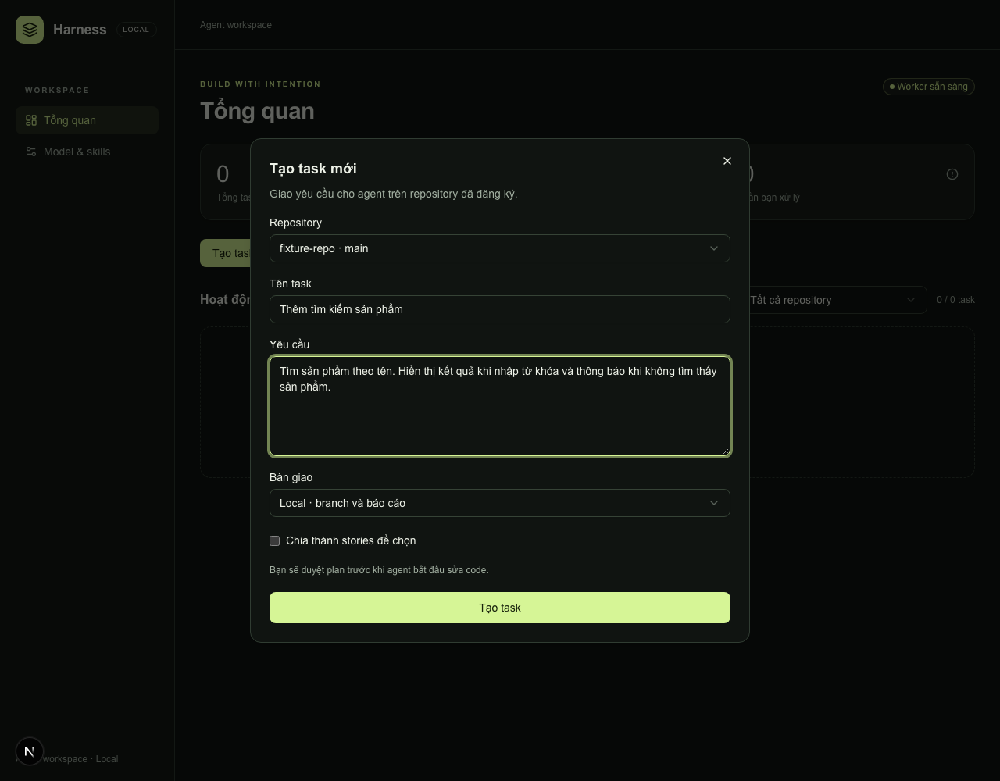
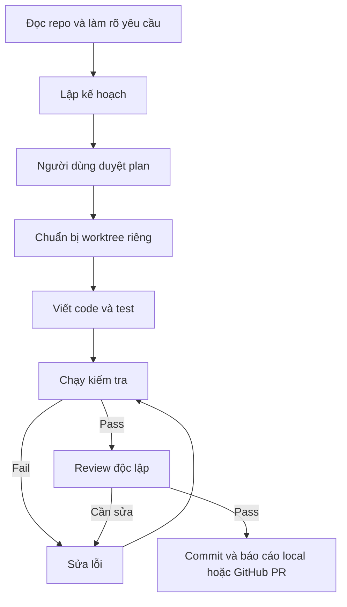

# Agent Harness

Agent Harness chạy local, nhận task trên repo Git và dùng Codex để viết code, chạy test, review rồi tạo commit hoặc GitHub PR. Plan cần được duyệt trước khi sửa code; mỗi task chạy trên branch/worktree riêng.

## Bắt đầu

### Chạy trực tiếp trên máy

Cài Node.js **>=24.18.0 và <25**, npm, Git và Codex CLI có `app-server`, native subagents. Phiên bản đã chạy thử trên macOS là `codex-cli 0.159.0-alpha.12.1`.

```sh
nvm use
npm ci
codex login
npm run dev
```

Mở [http://127.0.0.1:3000](http://127.0.0.1:3000) để dùng dashboard. `npm run dev` cũng khởi động worker chạy task ở phía sau. Nhấn `Ctrl+C` để dừng.

### Chạy bằng Docker

Cấu hình `docker-compose.yml` hiện dùng Docker Desktop trên macOS, Docker Compose từ 2.22.0 và SSH agent của Docker Desktop. Cần có file `~/.ssh/known_hosts`; khi dùng remote SSH, agent phải có key được cấp quyền và file này phải chứa host của remote. Thư mục repo mặc định là `~/Documents/Personal`; có thể đổi bằng biến `HARNESS_REPOS_DIR`.

```sh
docker compose up -d --build
```

Để tự build lại khi code thay đổi:

```sh
docker compose up --build --watch
```

Mở [http://127.0.0.1:3000](http://127.0.0.1:3000) và đăng nhập Codex. Trong Docker, đăng ký repo bằng đường dẫn `/repos/...`; ví dụ `~/Documents/Personal/my-app` trên máy tương ứng với `/repos/my-app`.

Xem log bằng `docker compose logs -f`, dừng bằng `docker compose down`. Dữ liệu vẫn được giữ. Image có sẵn Node.js, Python, Git và GitHub CLI. Nếu repo dùng Java hoặc runtime khác, cần thêm runtime đó vào image. Xem cấu hình sandbox ở [config/README.md](config/README.md).

## Tạo task đầu tiên



Chế độ **Duyệt quyền khi cần** yêu cầu xác nhận khi công cụ cần thêm quyền. **Auto sau khi duyệt Plan** không hỏi quyền công cụ; các giới hạn sandbox vẫn áp dụng. Cả hai đều cần duyệt plan trước khi chạy.

Nhấn **Bật thông báo** ở đầu workspace và cho phép trong trình duyệt để nhận thông báo khi agent cần quyền thực thi. Nhấn thông báo để mở đúng task và yêu cầu **Cho phép / Từ chối**.

Cần giữ ít nhất một tab Harness mở trong trình duyệt desktop hỗ trợ Notifications API và Web Locks. Nếu thông báo bị chặn, vẫn có thể duyệt quyền trên dashboard. Thông báo này không dành cho duyệt Plan.

## Một task chạy thế nào?



Nếu yêu cầu, phạm vi hoặc base remote thay đổi, cần duyệt lại plan. Harness tiếp tục sửa khi test hoặc review chưa đạt, **không giới hạn số vòng sửa**. Task vẫn dừng khi cần thông tin/quyền, hết quota, gặp lỗi runtime hoặc thiếu môi trường chạy; dashboard ghi rõ lý do. Có thể pause hoặc cancel trong quá trình chạy.

## Ai làm từng bước?

Worker quyết định bước nào chạy tiếp, chạy test và tạo commit/PR. Mỗi task có một agent cha giao việc cho các subagent. Mỗi lượt AI dùng một subagent mới, nhận thông tin cần cho lượt đó thay vì toàn bộ lịch sử của cha. Review dùng subagent riêng và chỉ được đọc code.

Subagent nhận hai loại hướng dẫn: **profile** nói nó phụ trách việc gì, **skill** nói cách làm việc đó. Nạp nhiều hướng dẫn vẫn chỉ chạy một subagent trong lượt ấy.

| Bước        | Ai thực hiện?                            | Công việc                                         |
| ----------- | ---------------------------------------- | ------------------------------------------------- |
| `discover`  | Subagent đọc repo                        | Xác định stack, convention và lệnh kiểm tra       |
| `analyze`   | Subagent phân tích + grilling            | Làm rõ yêu cầu và câu hỏi còn thiếu               |
| `plan`      | Subagent planner + writing-plans         | Lập phạm vi sửa, tiêu chí nghiệm thu và test plan |
| `prepare`   | Worker; subagent khi có conflict         | Tạo worktree và đồng bộ base remote               |
| `implement` | Subagent theo stack + TDD                | Viết code và test trong phạm vi đã duyệt          |
| `verify`    | Runner; subagent nếu có ảnh UI được chọn | Chạy test/checks và xem ảnh UI nếu plan yêu cầu   |
| `review`    | Subagent reviewer, chỉ đọc               | Kiểm tra code và test có đáp ứng plan không       |
| `repair`    | Subagent debugger + TDD                  | Sửa lỗi test hoặc lỗi reviewer tìm thấy           |
| `deliver`   | Worker                                   | Kiểm tra lần cuối, tạo commit/báo cáo hoặc PR     |

Danh sách profile và skill cho từng bước nằm trong [agents/README.md](agents/README.md) và [skills/README.md](skills/README.md).

## Giới hạn hiện tại

- Chạy local, một task mỗi lần; không tự merge hoặc deploy.
- Các kiểm tra bắt buộc trong plan và review phải pass trước khi bàn giao. Test cũ ngoài phạm vi có thể được bỏ qua và phải ghi rõ trong báo cáo.
- Dữ liệu lưu trong `.harness/` khi chạy trực tiếp, hoặc volumes khi dùng Docker.

## Khi sửa dự án này

Các lệnh để chạy test, kiểm tra kiểu dữ liệu và build:

```sh
npm test
npm run typecheck
npm run build
npx playwright install chromium
npm run test:e2e
```

E2E mô phỏng agent, còn Git, test runner và browser chạy thật. Test này chưa đủ để khẳng định toàn bộ luồng chạy được với model và GitHub thật. Các báo cáo dưới đây ghi rõ phần nào đã thử:

- [Thiết kế đã duyệt](docs/superpowers/specs/2026-09-23-agent-harness-design.md): yêu cầu và cách dự án hoạt động.
- [Agent profiles](agents/README.md) và [skills](skills/README.md): các hướng dẫn agent đang dùng và cách cập nhật.
- [Runtime cha–con](docs/verification/2026-10-05-parent-subagents.md): kết quả thử native subagents và những giới hạn còn lại.
- [Prepare và kiểm chứng UI](docs/verification/2026-10-05-prepare-ui-verify.md): đồng bộ base và kiểm tra ảnh giao diện.
- [Kiểm chứng MVP/Docker](docs/verification.md): kết quả và phần chưa xác nhận.

Xem [kiến trúc backend](docs/backend-architecture.md) để theo dõi application services, worker, adapters và giao tiếp cha–con.

Luồng chạy task nằm ở [pipeline/runtime.ts](src/application/pipeline/runtime.ts) và [pipeline/stages.ts](src/application/pipeline/stages.ts). Code chọn profile và skill nằm ở [context/agents.ts](src/infrastructure/context/agents.ts) và [context/skills.ts](src/infrastructure/context/skills.ts).

## Chia feature thành stories

Khi tạo task, bật **Chia thành stories để chọn**. Planner đề xuất story có kết quả, tiêu chí nghiệm thu, dependency và point (1, 2, 3, 5, 8). Point thể hiện độ phức tạp và bất định; không quy đổi sang token hoặc phần trăm quota. Chọn story cùng toàn bộ dependency rồi duyệt plan.

- **PR riêng từng story:** mỗi story có task và branch riêng, dùng cùng lựa chọn GitHub/local của feature. Story phụ thuộc chỉ chạy khi commit trước đã được tích hợp vào nhánh đích. Harness không tự merge. Base thay đổi yêu cầu duyệt plan mới của task con. Squash/rebase không chứng minh được bằng ancestry thì dừng chờ người dùng xử lý.
- **Một PR cho toàn feature:** dùng chung branch; từng story qua test và review rồi lưu commit/checkpoint. Sau story cuối, kiểm tra lại toàn bộ phạm vi đã chọn trên snapshot cuối trước khi tạo PR hoặc bàn giao local.

Mặc định **dừng sau mỗi story**; bấm **Tiếp tục** để chạy phần tiếp theo. Có thể bật **Tự tiếp tục các stories đã chọn**, nhưng các gate về dependency, approval, test và review vẫn áp dụng. Trang feature có tiến độ, checkpoint và link task con/PR. Pause hoặc hết quota giữ checkpoint đã hoàn thành; resume không thực hiện lại story đó. Cách chia này giảm phần việc dang dở, không bảo đảm quota luôn đủ cho một story.

[Thiết kế story delivery](docs/superpowers/specs/2026-10-06-story-delivery-design.md) · [Kế hoạch triển khai](docs/superpowers/plans/2026-10-06-story-delivery.md).

## Kiểm tra code

```sh
npm run lint          # ESLint, không chấp nhận warning
npm run lint:fix      # Tự sửa các lỗi ESLint hỗ trợ
npm run format       # Format bằng Prettier
npm run format:check # Kiểm tra format
npm run typecheck
```
