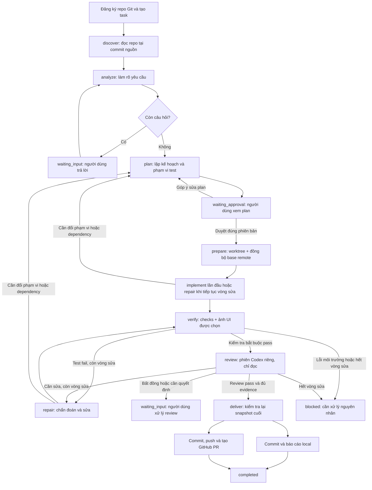
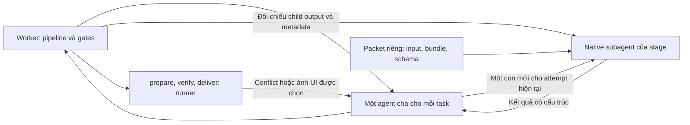
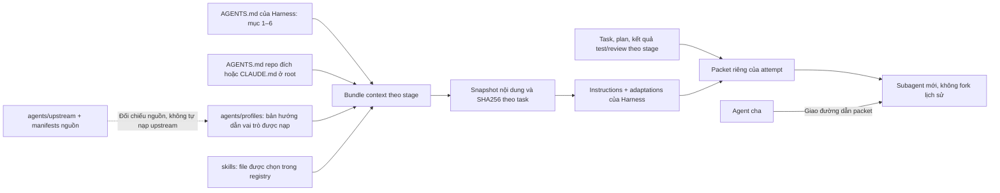

# Agent Harness

Agent Harness là công cụ chạy local để điều phối **Codex trên một repository Git có sẵn**: đọc repo → làm rõ yêu cầu → lập và duyệt kế hoạch → viết code/test → kiểm thử → review → sửa lỗi → bàn giao.

Dashboard dùng Next.js; worker Node.js chạy độc lập và lưu trạng thái bằng SQLite. Repo đích có thể dùng ngôn ngữ/framework khác. Worker xử lý một task tại một thời điểm, mỗi task có branch và worktree riêng.

README này mô tả **code hiện tại**. [Spec đã duyệt](docs/superpowers/specs/2026-09-23-agent-harness-design.md) là căn cứ thiết kế; các báo cáo kiểm chứng có ngày/branch riêng, không chứng nhận mọi thay đổi mới trong workspace.

## 1. Luồng hoạt động



- **Trước khi code:** người dùng duyệt phiên bản plan, phạm vi file, tiêu chí nghiệm thu và test bắt buộc. Góp ý plan tạo vòng lập kế hoạch lại.
- **Trong khi code:** chỉ `implement` và `repair` được cấp quyền ghi cho phiên Codex. Nếu cần đổi requirement/phạm vi/dependency, approval cũ mất hiệu lực và phải duyệt plan mới.
- **Khi quay lại plan:** giữ worktree, edits và số vòng sửa đã dùng; không cấp lại ba vòng sửa.
- **Trước khi bàn giao:** worker kiểm tra plan, kết quả test, review và fingerprint của code còn khớp nhau. Lời khẳng định “đã pass” của model không đủ để mở gate.
- **Khi gặp vấn đề:** task giữ stage và lý do chờ/chặn. `stage` là bước công việc; `status` là trạng thái như `running`, `waiting_input`, `waiting_approval`, `blocked`, `paused`.

Tối đa **ba attempt `repair`** sau lần triển khai đầu. Failure dự kiến của test trong bước TDD red không tự tiêu một vòng repair.

## 2. Ai làm từng bước? Dùng skill/agent/subagent nào?

Trong Harness này:

- **Skill:** tài liệu hướng dẫn cách làm việc, được ghép vào context của stage.
- **Agent profile:** hướng dẫn vai trò, cũng được ghép vào context. Nạp nhiều profile không có nghĩa là chạy nhiều agent.
- **Agent cha:** mỗi task có một parent thread bền vững, dùng `gpt-6-luna/medium`, chỉ giao nhiệm vụ và chờ kết quả. Worker vẫn quyết định stage, approval, tests, repair budget và bàn giao.
- **Subagent:** mỗi attempt AI tạo đúng một con native mới, `fork_turns="none"`, dùng model/effort của stage. Con nhận đường dẫn packet riêng chứa input, frozen bundle và output schema; không nhận lịch sử hội thoại của cha. System/runtime, developer instructions theo vai trò và hướng dẫn repo vẫn có thể được kế thừa.



Worker xác minh parent/child ID, model/effort, cwd, sandbox, native spawn và kết quả cuối của con trước khi chấp nhận kết quả của cha. Resume giữ cha, attempt tiếp theo dùng con mới. Pause/cancel ngắt cả cây và giữ exclusion nếu chưa xác nhận writer đã dừng; không fallback về các phiên stage độc lập. Quyền của cha và con cùng sandbox của stage, nên yêu cầu cha chỉ điều phối là giới hạn hành vi, không phải sandbox riêng.

Đã kiểm chứng trên CLI `0.159.0-alpha.12.1`; runtime bật `multi_agent` và `multi_agent_v2` theo parent thread. Khi resume không có raw events, adapter đọc native spawn từ rollout path do app-server trả. Runtime này mã hóa `spawn_agent.message`: nội dung plaintext được đối chiếu khi có; ciphertext không thể đối chiếu nguyên văn. Không coi ciphertext là bằng chứng toàn bộ lời giao việc chính xác. Xem [kiểm chứng cha–con](docs/verification/2026-10-05-parent-subagents.md).

| Stage | Người/tiến trình thực hiện và quyền | Agent profile nạp vào context | Skill nạp vào context | Kết quả |
| --- | --- | --- | --- | --- |
| `discover` | Subagent, chỉ đọc snapshot repo | `harness/repo-explorer` — hướng dẫn inline trong code | Không có file skill riêng | Repo Profile: stack, convention, lệnh đề xuất và căn cứ |
| `analyze` | Subagent, chỉ đọc | `voltagent/business-analyst` | `mattpocock-skills/grilling` | Phân tích yêu cầu; câu hỏi chưa rõ hoặc chuyển sang plan |
| `plan` | Subagent, chỉ đọc | `ecc/planner` | `superpowers/writing-plans` | Plan có phiên bản, file cần sửa, tiêu chí nghiệm thu và command kiểm tra |
| `prepare` | Worker fetch/merge base trong worktree và cập nhật context | Chỉ dùng model repair khi có conflict | Prompt giới hạn conflict và rule repo | Baseline mới cần discovery/plan và duyệt lại; giữ nguyên repo gốc |
| `implement` | Subagent, `workspace-write` trong worktree | Một specialist hoặc `harness/implementer`, cộng `ecc/tdd-guide`; thêm `ecc/e2e-runner` nếu plan có E2E | `superpowers/test-driven-development` và `writing-good-tests.md` | Code và test trong phạm vi đã duyệt; chuyển sang verify hoặc yêu cầu replan |
| `verify` | Runner chạy checks; UI selection dùng một child read-only | Model review chỉ khi có screenshot được chọn | Prompt đọc ảnh rút gọn | E2E + 1–6 ảnh PNG; verdict/hash/fingerprint bắt buộc trước bàn giao |
| `review` | Subagent mới, chỉ đọc | `ecc/code-reviewer` | `superpowers/requesting-code-review` và `code-reviewer.md` | Findings, verdict và evidence cho từng tiêu chí nghiệm thu |
| `repair` | Subagent, `workspace-write` trong worktree | `voltagent/debugger`, `ecc/build-error-resolver`, `ecc/tdd-guide`; thêm `ecc/e2e-runner` nếu plan có E2E | `receiving-code-review`, `systematic-debugging` + `root-cause-tracing.md`, `test-driven-development` + `writing-good-tests.md`, `verification-before-completion` — đều thuộc Superpowers | Sửa theo test/review, test hồi quy và quay lại verify; đổi phạm vi thì replan |
| `deliver` | Worker thực thi Git/GitHub và xuất báo cáo | Không gọi model | Không nạp skill | Commit + báo cáo local, hoặc commit + push + GitHub PR |

**Specialist của `implement` được chọn từ bằng chứng trong repo nguồn:**

| Stack phát hiện | Profile |
| --- | --- |
| Có dependency `next` | `voltagent/nextjs-developer` |
| React, Vue hoặc Angular, không có Next.js | `voltagent/frontend-developer` |
| Có source/manifest Python | `voltagent/python-pro` |
| Maven/Gradle có `org.springframework.boot` | `voltagent/spring-boot-engineer` |
| Chưa nhận diện hoặc có nhiều stack ứng viên | `harness/implementer` dùng convention của từng vùng code |

`ecc/e2e-runner` là hướng dẫn bổ sung trong cùng phiên implement/repair, không phải tiến trình E2E hay subagent riêng. Command E2E đã duyệt phải tự quản lý khởi động server, readiness, port và cleanup.

**Điểm cần phân biệt với spec:** registry hiện tại chưa nạp `brainstorming` ở analyze, chưa nạp `systematic-debugging` ở analyze/implement. Debugging được nạp ở repair. Verify/deliver áp dụng gate bằng code worker, không có lượt AI nạp `verification-before-completion`. Không coi các nhánh hướng dẫn trong spec là chức năng runtime đã có.

Nguồn mapping thực tế: [agent registry](src/context/agents.ts), [skill registry và adaptations](src/context/skills.ts), [stage handlers](src/worker/stages.ts).

## 3. Context và các file reference được dùng thế nào?



Ở lần chạy AI đầu, worker đóng băng bundle cho các stage AI. Khi `prepare`, worker bổ sung rule của thư mục liên quan đến file trong plan cho implement/repair/review và kích hoạt profile E2E nếu plan có kiểm tra E2E. Snapshot được lưu thành artifact `context-<stage>-<hash>.json`.

- Rule nền chỉ lấy **mục 1–6** của `AGENTS.md` Harness; mục 7 dành riêng cho phát triển Harness.
- Root repo đích ưu tiên `AGENTS.md`, dùng `CLAUDE.md` khi không có `AGENTS.md`. Trong thư mục con, loader đọc `AGENTS.md` theo phạm vi file của plan.
- Task có từ khóa Liquid/Shopify được loader yêu cầu `rules/lighthouse-performance.md` của repo đích; thiếu file thì bị chặn. Không áp dụng rule này cho mọi repo.
- Adaptations quy định đầu ra tiếng Việt, schema của Harness, phạm vi đã duyệt và quyền điều phối của worker. Metadata model/tool trong tài liệu upstream không cấp quyền cho agent.
- Sửa file skill/profile không âm thầm thay snapshot đã lưu của task cũ. Runtime đọc bản đóng gói trong repo, không tải hướng dẫn upstream khi chạy.

### Bản đồ tài liệu

Phần hướng dẫn dành cho người dùng/maintainer dùng tiếng Việt; giữ nguyên tên stage, ID skill/profile và thuật ngữ tech. Profile runtime và bản gốc upstream có thể dùng tiếng Anh; vai trò của chúng được giải thích trong hai README chuyên mục bên dưới.

| File/thư mục | Đọc để làm gì? | Runtime có dùng không? |
| --- | --- | --- |
| [README này](README.md) | Hiểu luồng tổng thể, cách chạy và giới hạn | Không nạp vào bundle bằng registry |
| [Spec đã duyệt](docs/superpowers/specs/2026-09-23-agent-harness-design.md) | Tra requirement, gate và thiết kế đã thống nhất | Không tự nạp vào task trên repo đích |
| [agents/README.md](agents/README.md) | Tra vai trò từng profile, routing và cách cập nhật | README không nạp; file `profiles/` được chọn mới nạp |
| [skills/README.md](skills/README.md) | Tra skill và reference phụ đi kèm từng stage | README không nạp; file trong registry mới nạp |
| [agents/sources.json](agents/sources.json) | Tra URL upstream được pin commit và hash bản gốc | Loader dùng để ghi nguồn của profile |
| [skills/sources.json](skills/sources.json) | Tra nguồn, phiên bản distribution và hash file đóng gói | Metadata để kiểm tra nguồn; không phải instructions |
| [docs/superpowers/plans/](docs/superpowers/plans/) | Kế hoạch phát triển Harness theo từng thay đổi | Không phải plan runtime của task repo đích |
| [Kiểm chứng MVP/Docker](docs/verification.md) | Xem đã kiểm tra gì và phần chưa xác nhận trong các lần ghi nhận | Báo cáo lịch sử |
| [Kiểm chứng agent mapping](docs/verification-agent-mapping.md) | Xem bằng chứng cho profile routing và model policy | Báo cáo lịch sử; mục skill roots phản ánh phiên bản cũ |
| [Kiểm chứng portable bundle/pipeline UI](docs/verification/2026-10-04-portable-pipeline-ui.md) | Xem bằng chứng về bundle portable, context và pipeline UI | Báo cáo lịch sử |

Nếu cần tìm nơi thay đổi hành vi, bắt đầu từ:

| Muốn kiểm tra/thay đổi | File chính |
| --- | --- |
| Chọn agent theo stage/stack | [src/context/agents.ts](src/context/agents.ts) |
| Chọn skill, reference và adaptations | [src/context/skills.ts](src/context/skills.ts) |
| Nạp rule repo và hash nội dung | [src/context/rules.ts](src/context/rules.ts) |
| Ghép bundle thành instructions | [src/context/prompts.ts](src/context/prompts.ts) |
| Điều phối attempt, pause/resume và repair count | [src/worker/engine.ts](src/worker/engine.ts) |
| Thực hiện từng stage, snapshot và review | [src/worker/stages.ts](src/worker/stages.ts) |
| Gate duyệt plan và chuyển stage | [src/core/transitions.ts](src/core/transitions.ts) |
| Kiểm tra tiêu chí nghiệm thu | [src/core/acceptance.ts](src/core/acceptance.ts) |
| Model mặc định và effort | [src/core/model-policy.ts](src/core/model-policy.ts) |
| Giao tiếp Codex app-server và quyền của phiên | [src/codex/client.ts](src/codex/client.ts) |
| Chạy command và thu evidence | [src/execution/checks.ts](src/execution/checks.ts) |
| Commit, báo cáo local, push và tạo PR | [src/delivery/github.ts](src/delivery/github.ts) |

## 4. Chạy Harness

### Docker

Yêu cầu Docker Desktop đang chạy.

```sh
docker compose up -d --build
```

Mở [http://127.0.0.1:3000](http://127.0.0.1:3000), chọn **Đăng nhập Codex** → **Đăng nhập với OpenAI** và hoàn tất đăng nhập trong cửa sổ OpenAI. Không cần nhập API key hoặc đăng nhập bằng terminal. Luồng OAuth có fixture tests và smoke container; việc đăng nhập tài khoản OpenAI thật trong Docker chưa được xác nhận trong [báo cáo kiểm chứng](docs/verification.md).

Compose chạy dashboard và worker. Dữ liệu và thư mục phiên Codex nằm trong volumes; cổng dashboard/OAuth callback chỉ mở trên máy local.

Compose dùng [profile seccomp cho Codex sandbox](config/README.md) để bubblewrap tạo namespace con trong Docker. Sandbox của từng stage vẫn giới hạn ghi file và network; không cấp `SYS_ADMIN` hoặc dùng container privileged.

Repo trong `~/Documents/Personal` xuất hiện trong container tại `/repos`. Ví dụ đăng ký `/repos/my-app` cho repo `~/Documents/Personal/my-app`. Đổi thư mục chia sẻ bằng:

```sh
HARNESS_REPOS_DIR=/absolute/path/to/projects docker compose up -d
```

```sh
docker compose logs -f   # Xem log
docker compose down     # Dừng và giữ volumes
```

Image có Node.js, Python, Git và GitHub CLI. Repo cần Java hoặc toolchain khác phải bổ sung runtime vào image. Tạo PR cần đăng nhập `gh` và quyền push riêng.

### Chạy trực tiếp

Yêu cầu:

- Node.js **>=24.18.0 và <25**, npm, Git.
- Codex CLI hỗ trợ `app-server`, đã đăng nhập.
- GitHub CLI (`gh`) và quyền push nếu chọn bàn giao GitHub.

```sh
nvm use
npm ci
codex login
npm run dev
```

`npm run dev` khởi động dashboard và worker. Mở [http://127.0.0.1:3000](http://127.0.0.1:3000); dùng `Ctrl+C` để dừng. Môi trường native đã kiểm chứng là macOS; Windows chưa được kiểm chứng.

### Giao một task

1. Trong **Model & skills**, kiểm tra model cho các stage AI. Mặc định `plan` dùng `gpt-6-astra`/`high`; các stage AI khác dùng `gpt-6-luna`/`medium`. Effort cố định trong code; model thay được trên UI và được kiểm tra với catalog runtime.
2. Đăng ký repo Git có commit và nhánh nguồn. Trên macOS native, bấm **Chọn thư mục…** hoặc nhập đường dẫn; trong Docker nhập đường dẫn `/repos/...`. Hủy hộp thoại giữ nguyên đường dẫn hiện có.
3. Tạo task, trả lời câu hỏi làm rõ, xem hoặc góp ý plan rồi duyệt.
4. Theo dõi pipeline, diff, kết quả test và review; xử lý approval hoặc nguyên nhân blocked khi xuất hiện.
5. Nhận báo cáo local hoặc GitHub PR theo chế độ bàn giao đã chọn. Local delivery cũng có thể tạo commit trong worktree.

Chế độ `manual` chuyển yêu cầu quyền công cụ được hỗ trợ lên dashboard. Chế độ `auto` dùng policy không hỏi quyền và từ chối yêu cầu escalation nếu runtime vẫn gửi; cả hai vẫn cần duyệt plan và tuân thủ sandbox.

## 5. Dữ liệu và giới hạn

Native lưu SQLite, artifacts và worktrees trong `.harness/`, không commit. Docker lưu dữ liệu tại `/data` trong volume `harness-data`, phiên Codex trong volume `codex-login`. Dùng `HARNESS_DATA_DIR` để đổi nơi lưu; dashboard và worker phải dùng cùng thư mục dữ liệu.

- Chỉ dành cho sử dụng local, lắng nghe trên loopback.
- Prepare được phép merge base remote vào worktree task; không tự merge task vào base, deploy hoặc xóa worktree.
- Test bắt buộc phải có evidence pass; test ngoài phạm vi bỏ qua vẫn ghi `skipped`.
- Model/effort hoặc quota không khả dụng sẽ chặn task; không tự fallback.
- Sau crash, task có thể bị khóa đến khi xác nhận runtime cũ đã dừng.
- Runtime hiện dùng Codex app-server; chưa có adapter Claude Code hoặc vòng agent chạy trực tiếp bằng API key.
- Chọn bàn giao local nếu không có remote GitHub phù hợp. Chế độ GitHub gặp remote không được hỗ trợ sẽ báo lỗi, không tự đổi sang local.

## 6. Kiểm tra dự án

```sh
npm test
npm run typecheck
npm run build
npx playwright install chromium
npm run test:e2e
```

E2E dùng fixture agent và repo tạm để kiểm tra luồng ứng dụng với Git/runner/browser thật. Chúng không xác nhận pipeline ghi code bằng model thật hoặc tạo PR GitHub thật. Xem các báo cáo ở mục bản đồ tài liệu để biết phạm vi từng lần kiểm chứng.


## Prepare và kiểm chứng UI

Prepare đồng bộ `baseBranch` từ remote đã đăng ký (thường là origin) vào worktree riêng. Base đổi làm approval cũ hết hiệu lực: harness giữ worktree, cập nhật discovery/plan rồi chờ duyệt version mới. Worktree còn code chưa commit thì chặn đồng bộ, không tự bỏ edits. Clean merge không gọi AI; chỉ conflict mới gọi model repair với các file liên quan. Repo không có remote tiếp tục chạy local.

Task thay đổi giao diện khai báo `uiVerification` trong plan. E2E kiểm tra hành vi và tạo ảnh mới; sau khi checks bắt buộc pass, model review chỉ xem các ảnh đã chọn. Task logic hoặc plan cũ chưa có selection không phát sinh lượt AI ở verify. Visual fail đi vào repair, ảnh thiếu hoặc sai viewport thì blocked. Tests có link mở ảnh; delivery kiểm tra lại hash ảnh và source fingerprint.

Ví dụ selection trong plan (check `ui-e2e` phải là required E2E và được ánh xạ vào tiêu chí `AC-UI`):

```json
{
  "uiVerification": {
    "screenshots": [{
      "id": "mobile",
      "checkId": "ui-e2e",
      "path": "evidence/mobile.png",
      "criterionIds": ["AC-UI"],
      "viewport": { "width": 390, "height": 844 },
      "referencePath": null
    }]
  }
}
```

Tối đa 6 ảnh PNG, capture viewport-only với `deviceScaleFactor=1`; đường dẫn screenshot/reference tính từ root của worktree. Có ảnh thiết kế local thì dùng `referencePath`; không có thì mô tả rõ kỳ vọng trong tiêu chí UI. Command E2E tự quản lý server và tạo thư mục chứa ảnh. Runner chỉ chạy checks đã duyệt, không tự cài tooling hoặc dựng test thay agent.
