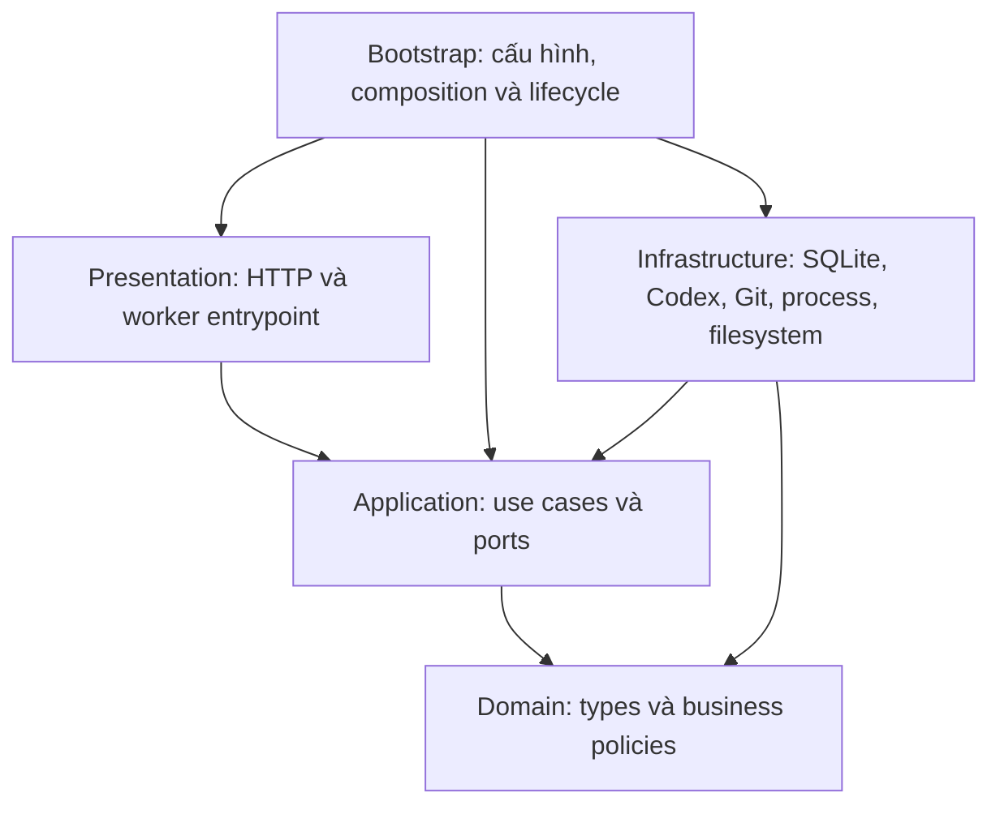
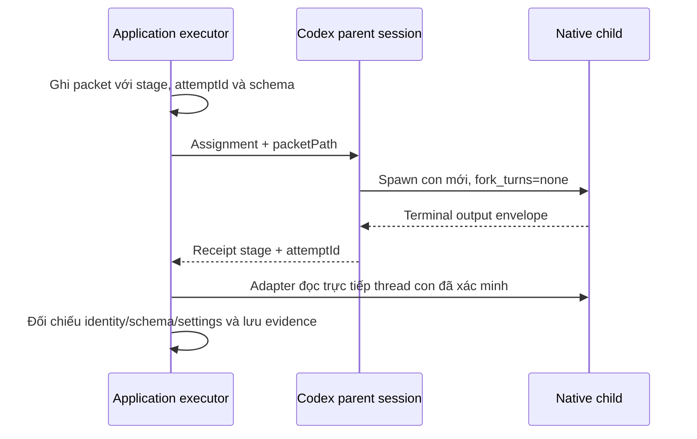

# Kiến trúc backend

Backend dùng Clean Architecture, giữ HTTP API, SQLite schema/record keys, serialization, frozen bundles và packet/artifact format. Không migration dữ liệu. Web và worker là hai tiến trình riêng; bootstrap dùng chung factory services nhưng worker nhận repository view trên connection đã lease-fence.

Mũi tên là dependency của source code. Domain/application không import framework hoặc infrastructure, kể cả type imports. Các module nghiệp vụ trong application giao tiếp qua public `index.ts`; shared port/contracts nằm tại application root để tránh vòng phụ thuộc type. Không có DI framework, generic base service/repository hoặc legacy compatibility facade.

| Lớp            | Vị trí và trách nhiệm                                                                                                                                                                                                         |
| -------------- | ----------------------------------------------------------------------------------------------------------------------------------------------------------------------------------------------------------------------------- |
| Domain         | `src/domain`: task initialization/immutability, transition, approval, model/effort policy, story selection/replan, acceptance và evidence rules. TypeScript thuần; không Zod/Next/Node I/O.                                   |
| Application    | `src/application`: models, tasks, planning, stories, repositories, agent-execution, pipeline, verification, delivery, dashboard, sessions, system và artifacts. Sở hữu ports, transaction boundaries và input/output types.   |
| Infrastructure | `src/infrastructure`: SQLite repositories/lease, Codex RPC/login/native receipts, semantic Git operations, context loader, process/evidence parsers và filesystem adapters. Zod/JSON Schema conversion ở validation adapters. |
| Presentation   | `src/presentation`: HTTP request parsing/response/error/cookie mapping, public dashboard DTO, worker entrypoint. Không đọc database/Git/filesystem.                                                                           |
| Bootstrap      | `src/bootstrap`: nối services và adapters, chọn agent/test fixture, cấu hình data directory, startup/shutdown. Next route files gọi composition root; worker chạy `worker-main.ts`.                                           |

## Model và agent execution

`ModelService` dùng SettingsRepository và ModelCatalogPort. Settings/tạo task kiểm tra catalog; task lưu snapshot model/execution mode độc lập với settings mới. Configure giữ stage-boundary gate và chỉ normalize effort; trước attempt runtime kiểm tra lại parent và role model. Không fallback. Mặc định plan dùng gpt-6-astra/high, role khác gpt-6-luna/medium, parent gpt-6-luna/medium. Prepare conflict dùng repair role; UI verification dùng review role.

Application tách ContextPreparation, packet preparation, StageAgentExecutor, ApprovalBroker và RuntimeRecording. Adapter chịu source snapshot, file hash, bundle snapshot, ghi packet bất biến, Zod codec và RPC. Giữ validation errors và thời điểm giải mã output. Bundle provenance identifier cũ giữ nguyên để không thay frozen artifact contract.

Một task giữ một parent; mỗi attempt dùng con mới. Native child khác story child task có pipeline riêng. Receipt có thể đến trước child completion. Cancel phải chờ startup settle, ngắt cây và xác nhận terminal. Mất visibility giữ runtime_state_unknown và chặn writer mới. Repair không giới hạn số vòng; các approval, scope, environment và evidence gates vẫn giữ nguyên.

## Persistence, verification và delivery

ApplicationStore có named typed slices cho task/plan/story/settings/attempt/runtime/event/command/evidence. SQLite adapter giữ getRecord(kind,id), JSON casts và serialization ở phía ngoài. UnitOfWork.atomic đồng bộ; nested savepoint dùng cùng connection. Không RPC/Git bất đồng bộ trong transaction. Repository removal giữ trình tự transaction và synchronous artifact cleanup hiện có.

Typed repository view được tạo từ fencedStore, không từ raw connection. Mọi task/record/event/command/effect write của worker giữ lease fencing. Optimistic revision, command idempotency và recovery exclusions không đổi.

Application sở hữu check orchestration và visual verdict policy. Process runner, TAP/JUnit parser, bounded report reads, screenshot collection/hash và image verification là adapters. Required skipped/failing checks, stale fingerprint và evidence thay đổi tiếp tục chặn delivery.

Delivery/checkpoint orchestration dùng semantic Git, GitHub và artifact ports. Intent/confirmed effects vẫn reconcile commit/push/PR sau crash hoặc mất response; retry không tạo commit/push/PR trùng. Report và checkpoint naming/content giữ nguyên.

## Guardrails và kiểm chứng

`tests/support/dependencies.ts` dùng TypeScript compiler API resolve relative/alias imports, re-export, dynamic import, CommonJS require và import types. `tests/unit/backend-boundaries.test.ts` audit toàn domain/application/infrastructure/presentation/bootstrap, cả vòng phụ thuộc type, không dùng danh sách ngoại lệ. Fixtures trong clean-dependencies test chứng minh checker bắt vi phạm, gồm chặn presentation import trực tiếp Node builtins và các package SQLite/Git/GitHub đã nhận diện; framework/request validation vẫn được phép.

Node 24.18 là runtime bắt buộc. Chạy `npm test`, `npm run typecheck`, `npm run lint`, `npm run build`, `npm run test:e2e`. E2E dùng fixture; `scripts/parent-subagents-smoke.ts` dùng Codex thật trong Git repo tạm riêng. Báo cáo cập nhật tại [verification](verification/2026-10-09-clean-architecture.md). Rollback theo commit đã kiểm chứng; không chạy hai phiên bản worker cùng dữ liệu.
