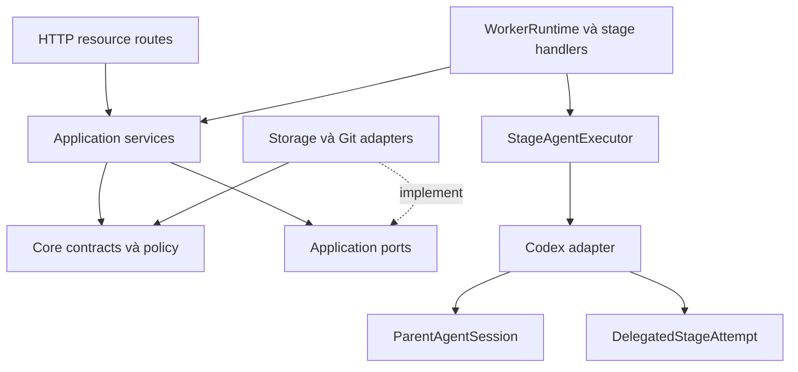
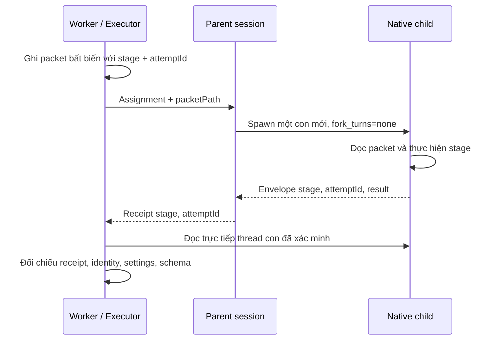

# Kiến trúc backend

Backend giữ nguyên HTTP contract, record lưu trữ, SQLite schema và artifact format. Refactor không yêu cầu migration dữ liệu. Các thành phần có trạng thái hoặc lifecycle dùng class; policy, validation và projection dùng hàm thuần.

Application services không import server hoặc worker. Delivery nhận context story đã được application kiểm tra; core không import execution. Kiểm tra dependency trong `tests/unit/backend-boundaries.test.ts` chặn các hướng phụ thuộc đã loại bỏ và vòng import runtime.

| Thành phần              | Trách nhiệm và vị trí                                                                                                                                                     |
| ----------------------- | ------------------------------------------------------------------------------------------------------------------------------------------------------------------------- |
| `PlanService`           | Plan bất biến, feedback/comment/revision; sở hữu transaction của use case trong `src/application/plan-service.ts`.                                                        |
| `StoryService`          | Selection, execution plan, baseline, evidence, checkpoint context và trạng thái story. Điều phối Git nằm trong `story-orchestration.ts`; validation thuần nằm trong core. |
| `TaskService`           | Tạo task, áp dụng settings, kiểm tra model/repository và chốt branch/base; HTTP chỉ chuyển request và trả response.                                                       |
| `WorkerRuntime`         | Lease, heartbeat, scheduling và active attempt. Control commands, startup recovery và kết quả attempt có module riêng.                                                    |
| Stage handlers          | Chín stage được đăng ký trong `src/worker/stages.ts`; implement/repair dùng chung mutation handler. Handler không chứa protocol Codex.                                    |
| `StageAgentExecutor`    | Freeze bundle, tạo packet, chọn model, chạy delegated stage, validate schema và lưu runtime evidence.                                                                     |
| `ApprovalBroker`        | Theo dõi approval pending, trả lời request và dọn timer khi attempt kết thúc.                                                                                             |
| `ParentAgentSession`    | Tạo/resume cha, loại trừ runtime cũ còn chạy; cập nhật và đọc lại settings trước assignment.                                                                              |
| `DelegatedStageAttempt` | Theo dõi spawn/event, xác minh con, receipt và completion; ngắt cây và xác nhận terminal khi cancel hoặc sai contract.                                                    |
| Storage                 | Task/event/command/record repositories dùng cùng một SQLite connection. Transaction, revision, command idempotency và lease fencing nằm ở facade/adapter.                 |
| Execution               | Process lifecycle, evidence collection và UI artifact verification; TAP/JUnit parsing được tách trong `check-evidence.ts`.                                                |
| Delivery                | Checkpoint/commit/push/PR orchestration; GitHub CLI transport nằm trong `github-cli.ts`.                                                                                  |
| HTTP                    | Auth/body limit/error mapping trong facade; routing theo system/settings/repositories/tasks/artifacts.                                                                    |

## Giao tiếp worker → cha → con

Một task giữ một parent; mỗi attempt dùng một native child mới. `runDirectTurn` và `runDelegatedStage` có input riêng; delegated input bắt buộc có stage, attemptId và packetPath. Tên RPC của app-server giữ nguyên. Native child agent khác với story child task: story child task có lifecycle pipeline và record riêng.

Receipt có thể đến trước child completion. Khi cancel, adapter chờ `turn/start` settle, ngắt cây qua hai lượt reconciliation và xác nhận terminal. Mất visibility giữ `runtime_state_unknown`; worker không tạo writer thứ hai khi chưa chứng minh runtime cũ đã dừng. Lease mất hiệu lực chặn ghi qua fenced store.

## Constants và kiểm chứng

Giới hạn được đặt trong module sở hữu, có đơn vị trong tên: ví dụ lease 15.000 ms, heartbeat 5.000 ms, RPC 30.000 ms, approval poll 100 ms. Repair budget ba lượt thuộc core policy. Các giá trị giữ nguyên baseline; HTTP status và PNG signature/offset giữ literal tiêu chuẩn.

Chạy bằng Node 24.18 theo `package.json`: `npm test`, `npm run typecheck`, `npm run build`, `npm run test:e2e`. E2E dùng agent fixture; smoke native dùng app-server thật trong repo tạm riêng. Kết quả refactor nằm trong [báo cáo kiểm chứng](verification/2026-10-06-backend-refactor.md).
