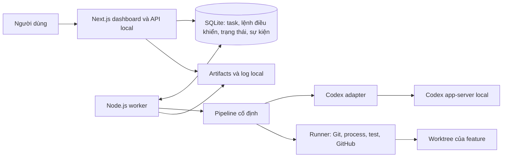

# Agent Harness — thiết kế MVP local

Ngày: 2026-09-23
Trạng thái: thiết kế đã duyệt ngày 2026-09-23; bổ sung theo yêu cầu người dùng ngày 2026-10-03: agent GitHub theo stage, effort cố định trong code (plan high, còn lại medium), model tiết kiệm ngoài planning và worktree riêng mỗi feature.

Bổ sung đã duyệt ngày 2026-10-05: [một agent cha và các subagent theo stage](2026-10-05-parent-subagents-design.md) thay cơ chế phiên AI độc lập. Một parent thread/task (`gpt-6-luna/medium`), con native mới cho từng attempt AI (`fork_turns="none"`), reviewer là con riêng chỉ đọc. Worker vẫn giữ gates, quyền, test verdict và delivery. Các đoạn “worker tạo phiên reviewer” dưới đây được thực hiện bằng việc cấp stage cho cha spawn đúng một con reviewer; skill của con không tự điều phối thêm. Xem [bằng chứng và giới hạn runtime](../../verification/2026-10-05-parent-subagents.md).

## 1. Mục tiêu và phạm vi

Xây công cụ cá nhân giúp giao một task trên repo có sẵn, làm rõ requirement, duyệt plan, rồi tự code, viết test, review, sửa và bàn giao PR. Mục tiêu là giảm thời gian người dùng phải can thiệp mà vẫn đáp ứng tiêu chí nghiệm thu.

Các quyết định sản phẩm đã chốt:

- Dashboard dùng Next.js, chạy local; một task thực thi tại một thời điểm.
- Nhận repo Git thuộc bất kỳ ngôn ngữ/framework nào. Không giới hạn repo đích ở Next.js.
- Tự đọc repo để giải quyết task người dùng giao; không tự tìm việc để làm.
- Pipeline có stage cố định, không có trình kéo thả workflow trong MVP.
- Dùng Codex làm coding agent, ưu tiên đăng nhập ChatGPT với quyền truy cập sẵn có.
- Người dùng duyệt requirement, plan, tiêu chí nghiệm thu và phạm vi test trước khi code.
- Mỗi feature/task có branch và worktree riêng; reviewer có phiên Codex riêng.
- Người dùng có thể chọn model theo stage; effort cố định trong code: plan/replan high, các stage AI khác medium. Mặc định plan dùng gpt-6-astra, còn lại gpt-6-luna. Không fallback khi model/effort không khả dụng.
- Stage AI dùng skill bundle rõ ràng và baseline hành vi từ `AGENTS.md`; runtime lưu nguồn/phiên bản đã nạp.
- Viết test cho tính năng mới và bug đang sửa; có thể bỏ qua test cũ ngoài phạm vi feature.
- Tối đa ba vòng sửa tự động sau lần triển khai đầu; hết giới hạn thì cần người dùng quyết định.
- Tạo GitHub PR khi đạt điều kiện; bàn giao local nếu remote không được hỗ trợ hoặc không có remote.
- Không tự merge task vào base, deploy hoặc xóa worktree. Theo cập nhật 2026-10-05, prepare được phép đồng bộ base remote vào worktree riêng.

Các lựa chọn kỹ thuật cụ thể dưới đây là đề xuất triển khai cho những quyết định trên và thuộc phạm vi review bản spec này.

## 2. Kiến trúc đề xuất

- **Web:** Next.js + TypeScript. Nhập task, duyệt plan, xem timeline/test/review và điều khiển pause/resume/cancel. API lưu yêu cầu điều khiển; không giữ agent chạy trong vòng đời HTTP request.
- **Worker:** tiến trình Node.js + TypeScript độc lập với web. Đọc yêu cầu từ database, chiếm quyền chạy một task, thực thi pipeline, ghi sự kiện và kết quả.
- **Persistence:** SQLite lưu dữ liệu có cấu trúc; filesystem lưu báo cáo, log lớn và ảnh/trace E2E. Đây là lựa chọn thiết kế phù hợp phạm vi một người dùng local, không yêu cầu dịch vụ database riêng.
- **Codex adapter:** giao tiếp app-server, cung cấp lấy danh sách model, bắt đầu/tiếp tục/ngắt lượt, nhận sự kiện và chuyển yêu cầu quyền hạn sang dashboard. Không trộn protocol Codex vào logic chuyển trạng thái.
- **Runner:** thực thi các lệnh đã được xác định cho repo, lấy exit code và báo cáo thật. Kết quả test không do lời khẳng định của model quyết định.
- **UI cập nhật:** đọc snapshot và sự kiện có sequence tăng dần; MVP dùng polling theo cursor. Đóng tab không dừng worker.

Chọn pipeline cố định vì có thể kiểm tra chính xác khi nào được code, retry, chờ người dùng hoặc tạo PR. Không dùng một agent toàn quyền tự chọn mọi bước; không xây workflow engine tùy biến ở MVP.

## 3. Repo discovery và môi trường

Người dùng nhập/chọn đường dẫn local đến repo Git, cấu hình base branch và remote. Hệ thống xác thực đường dẫn và branch tồn tại trước khi nhận task.

Discovery đọc hướng dẫn repo, manifest, lockfile, cấu trúc source, scripts, CI và cấu hình test. Kết quả là Repo Profile có:

- Repo root, commit đã đọc, các ngôn ngữ và khu vực chức năng.
- Lệnh setup/build/test, thư mục chạy lệnh, prerequisites và đường dẫn file làm căn cứ.
- Những điều chưa xác định được; không biến suy đoán thành cấu hình chạy chắc chắn.

Không đưa toàn bộ repo vào mỗi prompt. Lưu bản đồ tổng quan gắn với revision; mỗi task đọc sâu vùng liên quan. Khi branch/commit thay đổi, kiểm tra lại phần thông tin bị ảnh hưởng.

Hỗ trợ đa ngôn ngữ thông qua command specification: executable, arguments, cwd, biến môi trường được cho phép, timeout và đường dẫn báo cáo. Không hard-code mọi repo phải dùng npm hoặc cùng test runner. Khi không xác định được command đáng tin cậy, đề xuất command để người dùng xác nhận trong plan.

Máy thiếu runtime/database/service thì chuyển sang chờ thiết lập. Có thể cài project dependencies trong môi trường riêng theo plan; cài runtime hoặc thay đổi cấu hình hệ thống cần người dùng duyệt. Không tự thực thi script chỉ để đọc cấu trúc repo.

Không đọc nội dung secret vào context hay log. Credentials dùng cho môi trường test được truyền riêng khi cần, không ghi vào tài liệu kế hoạch.

## 4. Requirement và kế hoạch thực thi task

Stage phân tích kết hợp task với Repo Profile, sau đó hỏi người dùng những quyết định nghiệp vụ không thể suy ra từ code. Requirement mơ hồ khiến task chờ câu trả lời, không tự chọn hành vi sản phẩm.

Plan có phiên bản, bao gồm:

1. Mục tiêu và những gì ngoài phạm vi.
2. Tiêu chí nghiệm thu có ID ổn định.
3. Khu vực code dự kiến thay đổi, dependencies mới và yêu cầu môi trường.
4. Branch nguồn, commit nguồn và branch đích PR.
5. Test plan: từng kiểm tra, loại unit/integration/E2E, command, prerequisites, tiêu chí nghiệm thu được kiểm chứng.
6. Model/effort dự kiến cho từng stage AI và giới hạn vòng sửa.

Để model tầm trung có thể implement mà không phải thiết kế lại, plan phải chỉ rõ thứ tự bước và dependency, file/module cần thay đổi, interface và dữ liệu vào/ra khi có, hành vi lỗi liên quan, test cần viết, command kiểm tra và kết quả mong đợi. Bước không áp dụng một mục phải nêu lý do thay vì tạo thêm abstraction. Những quyết định sản phẩm còn mơ hồ phải được làm rõ trước approval.

Approval gắn với phiên bản plan và phạm vi công việc. Thay requirement, tiêu chí nghiệm thu, dependency hoặc mở rộng phạm vi làm mất hiệu lực approval cũ; trình phần thay đổi rồi chờ duyệt lại. Chi tiết triển khai trong phạm vi đã duyệt do agent tự quyết.

## 5. Pipeline và trạng thái

Tách **stage** (đang làm công việc gì) khỏi **status** (công việc đang chạy hay phải chờ). Cách này tránh nhân đôi trạng thái cho mọi nguyên nhân gián đoạn.

Stages: `discover`, `analyze`, `plan`, `prepare`, `implement`, `verify`, `review`, `repair`, `deliver`.

Statuses: `queued`, `running`, `waiting_input`, `waiting_approval`, `blocked`, `paused`, `interrupted`, `completed`, `cancelled`, `failed`.

Mỗi trạng thái chờ có reason và hành động cần thiết; ví dụ `quota`, `environment`, `model_unavailable`, `repair_limit`, `test_failure`, `delivery_error`.

| Stage | Đầu ra và điều kiện chuyển tiếp |
| --- | --- |
| discover | Repo Profile và kiểm tra khả năng thực thi → analyze |
| analyze | Requirement đủ rõ; thiếu thông tin → waiting_input; đủ → plan |
| plan | Plan có phiên bản → waiting_approval; được duyệt → prepare |
| prepare | Tạo/xác minh worktree, fetch base từ remote và merge trong worktree riêng; conflict dùng AI giới hạn theo file. Base đổi → discover/plan và duyệt lại; baseline giữ nguyên → implement hoặc repair |
| implement | Code và test cho tính năng mới/bug → verify |
| verify | Runner chạy checks; UI task có screenshot được chọn thì thêm một lượt AI đọc ảnh. Tất cả bắt buộc pass → review; lỗi hành vi/giao diện → repair; thiếu evidence/môi trường → blocked |
| review | Không còn finding bắt buộc sửa, đủ bằng chứng → deliver; có finding → repair |
| repair | Sửa theo lỗi test/review, tăng repair round → verify; thay phạm vi → plan |
| deliver | Kiểm tra evidence còn hiệu lực, commit/push/tạo PR hoặc xuất bàn giao local → completed |

`paused`, `interrupted`, `blocked` giữ stage hiện tại và lần chạy cuối. Resume phải qua bước đối chiếu thực tế trước khi xác định stage tiếp tục. `failed` dành cho lỗi không thể phục hồi của lần chạy, không dùng thay cho chờ hạn mức/môi trường.

Khi quay lại plan giữa vòng sửa, giữ worktree, branch và repair count. Duyệt plan mới không tạo implementation đầu tiên lần thứ hai và không tự cấp thêm vòng sửa.

Mỗi task có nhiều Stage Attempt. Một attempt lưu đầu vào, model/effort thực dùng, phiên Codex, thời điểm, status, revision và output. Sự kiện cũ không được sửa để che một attempt thất bại.

## 6. Model và context

Các stage `discover`, `analyze`, `plan`, `implement`, `review`, `repair` có cấu hình model/effort riêng. Viết test nằm trong implement/repair. Verify chạy command; chỉ gọi model review cho ảnh UI được chọn. Prepare dùng công cụ Git, chỉ gọi model repair khi có conflict. Deliver không gọi model; không thêm lựa chọn model riêng cho hai lượt tùy điều kiện này.

Chính sách theo yêu cầu ngày 2026-10-03, thay thế lựa chọn effort trên UI:

| Stage | Model mặc định | Effort |
| --- | --- | --- |
| plan, gồm replan | gpt-6-astra | high |
| discover, analyze, implement, review, repair | gpt-6-luna | medium |
| prepare | Worker; conflict dùng model repair đã chọn | medium khi có conflict |
| verify | Runner; ảnh UI dùng model review đã chọn | medium khi có screenshot |
| deliver | Worker, không gọi model | Không áp dụng |

Policy nằm trong `src/core/model-policy.ts`; thay effort bằng cách sửa code. UI vẫn cho đổi model nhưng hiển thị effort cố định. API chuẩn hóa effort khi lưu settings, tạo task và áp dụng model vào task; runtime và attempt log dùng effort của policy. Lựa chọn model cũ của task được giữ; lịch sử attempt và context snapshot đã ghi không bị sửa. Cặp model/effort không khả dụng phải blocked, không tự fallback. Model tiết kiệm là lựa chọn cấu hình, không cam kết mức quota hoặc số tiền cụ thể.

- Thứ tự model: snapshot task → cấu hình hệ thống → mặc định trong code.
- Khi tạo task, sao chép cấu hình mặc định vào task; chụp cấu hình thực dùng thành snapshot khi bắt đầu attempt. Thay setting chung không âm thầm đổi task đã tạo.
- Danh sách model và effort lấy từ runtime/tài khoản; kiểm tra cặp lựa chọn hợp lệ trước khi chạy.
- Model không khả dụng: báo và chờ người dùng chọn lại. Không tự fallback.
- Khi chuyển plan → implement, worker dùng model implement đã lưu mà không hỏi lại. Đây là chuyển model theo stage đã được cho phép, không phải tự động nâng/hạ model ngoài cấu hình.
- Thay model có hiệu lực ở lượt sau. Muốn đổi ngay phải ngắt lượt đang chạy, chờ nó dừng, đối chiếu file/process rồi tiếp tục.
- Model mới nhận requirement/plan đã duyệt, diff hiện tại, finding và kết quả kiểm tra liên quan. Không phụ thuộc vào trí nhớ ngầm giữa hai phiên.
- Nếu implement phát hiện plan thiếu quyết định hoặc sai giả định quan trọng, ghi rõ vấn đề và quay lại plan với model planner đã chọn; không tự mở rộng phạm vi. Plan thay đổi phải qua approval trước khi tiếp tục, giữ nguyên branch/worktree và repair count.
- Reviewer dùng phiên riêng với quyền chỉ đọc code; output có cấu trúc gồm finding, severity, file/căn cứ, tiêu chí bị vi phạm và verdict.
- Log hiển thị model/effort thực dùng, thời gian, usage khi runtime cung cấp. Không tự quy đổi usage thành USD của subscription.

Gói được người dùng mô tả là 25 USD/tháng chưa xác định được tên gói/hạn mức cụ thể. Tích hợp cần kiểm chứng đăng nhập, catalog model và một lượt read-only với tài khoản thực trước khi xây đầy đủ pipeline. Không tự chuyển sang API tính phí.

### 6.1. Rule nền và skill theo stage

Nguồn rule nền là [AGENTS.md](../../../AGENTS.md), mục 1–6: suy nghĩ trước khi code, đơn giản, thay đổi có mục tiêu, thành công có bằng chứng và trả lời tiếng Việt. Mục 7 chỉ phục vụ phát triển chính workspace harness, không truyền sang repo khác.

Harness đọc thêm `AGENTS.md` của repo đích và các hướng dẫn trong phạm vi thư mục liên quan. Nếu repo chỉ có `CLAUDE.md`, có thể dùng nội dung đó làm hướng dẫn dự án và ghi rõ nguồn. Không ghi đè những file này để cài rule của harness.

Rule `rules/lighthouse-performance.md` chỉ được nạp khi task liên quan Liquid/Shopify theme/Core Web Vitals của theme. Workspace hiện chưa có nội dung file này. Đây là dependency điều kiện: task không liên quan tiếp tục bình thường; khi áp dụng mà rule không có thì hỏi người dùng cung cấp rule, không giả lập nội dung.

Registry skill đã triển khai trong `src/context/skills.ts`; agent profile được map trong `src/context/agents.ts`. Theo yêu cầu cập nhật ngày 2026-10-04, worker nạp skills và profiles đóng gói trong repo (`skills/`, `agents/`), lưu snapshot nội dung và nguồn theo task. Bỏ cấu hình Skill roots; không phụ thuộc plugin cài trên máy. Task đã có snapshot giữ nguyên nội dung.

| Stage | Skill/bộ hướng dẫn mặc định | Trách nhiệm và kết quả |
| --- | --- | --- |
| discover | Hướng dẫn Repo Profile riêng của harness; chưa có file skill độc lập | Đọc code/manifest/CI, trả profile có căn cứ; không sửa repo. Đây là contract trong mục 3, không giả định có skill Superpowers chuyên discovery |
| analyze | `mattpocock-skills:grilling` | Hỏi các quyết định chưa rõ theo quan hệ phụ thuộc, đưa đề xuất và chờ câu trả lời; trả requirement/acceptance criteria |
| analyze — nhánh thiết kế mới | `superpowers:brainstorming`, khi task cần thiết kế kiến trúc/UI/hành vi chưa chốt | Khảo sát lựa chọn và đánh đổi. Dùng chung luồng hỏi/approval của harness, không mở thêm một vòng phỏng vấn trùng lặp |
| plan | `superpowers:writing-plans` | Kế hoạch có bước thực hiện, nơi thay đổi và điều kiện kiểm chứng; đầu ra gắn với PlanVersion |
| prepare | Worker thực thi Git/môi trường | Không nạp skill điều phối để agent tự tạo thêm worktree. Quyền và side effect thuộc worker |
| implement | `superpowers:test-driven-development` + rule mục tiêu/đơn giản/thay đổi có mục tiêu từ AGENTS.md | Red → green cho feature/bug; triển khai tối thiểu theo plan đã duyệt |
| verify | Runner + nguyên tắc `superpowers:verification-before-completion` | Runner là nguồn bằng chứng; chỉ báo pass khi command/report xác nhận. Không cần thêm lượt AI chỉ để gọi lại test |
| review | `superpowers:requesting-code-review` cho bước chuẩn bị; `requesting-code-review/code-reviewer.md` cho phiên reviewer riêng | Worker tạo review package gồm plan, diff/revision và test evidence; reviewer chỉ đọc, trả finding có cấu trúc |
| repair — nhận review | `superpowers:receiving-code-review` | Kiểm tra tính đúng đắn của finding; có thể phản biện bằng căn cứ, không sửa máy móc |
| repair — chẩn đoán và sửa | `superpowers:systematic-debugging` → `superpowers:test-driven-development` → `superpowers:verification-before-completion` | Tái hiện → thu bằng chứng → xác định nguyên nhân → kiểm chứng giả thuyết → test hồi quy → sửa tối thiểu → xác minh |
| deliver | Worker + nguyên tắc `superpowers:verification-before-completion` | Đối chiếu gate và evidence của snapshot cuối, tạo PR hoặc bàn giao local; không thêm một phiên AI để tự quyết merge |

`systematic-debugging` cũng kích hoạt ngay khi gặp bug/test failure/unexpected behavior trong analyze hoặc implement. Lỗi có sẵn ngoài phạm vi chỉ được ghi nhận, trừ khi nó chặn kiểm chứng feature. Chưa rõ root cause thì thu thêm bằng chứng hoặc hỏi, không nối tiếp các bản vá phỏng đoán.

Khi dùng TDD, expected failure trong bước red không tự động chuyển pipeline sang repair hoặc tiêu một vòng sửa. Bộ đếm tăng khi worker mở một attempt repair sau một lần verify/review không đạt. Trong repair, các giả thuyết/sửa thử được ghi lại; khi ba lần thử cùng vấn đề đều thất bại thì dừng hỏi lại thay vì lách giới hạn bằng cách giữ nguyên attempt.

### 6.2. Phạm vi áp dụng và giải quyết xung đột

Worker giữ quyền chuyển trạng thái, cấp quyền công cụ, tạo phiên reviewer, quản lý branch và đếm retry. Skill là hướng dẫn thực hiện trong stage, không được tự thay những cơ chế đó.

Mỗi bundle có ghi chú tích hợp minh bạch. Không sửa trực tiếp file trong plugin cache:

- **Phạm vi test:** yêu cầu trực tiếp của người dùng được ưu tiên hơn lời yêu cầu chạy toàn bộ suite trong skill TDD. Áp dụng red/green và verification cho Test Plan của feature; phần legacy bỏ qua vẫn xuất hiện trong báo cáo.
- **Approval:** yêu cầu hỏi/duyệt từ skill được chuyển thành `waiting_input` hoặc `waiting_approval` trên dashboard. Không tạo cổng duyệt thứ hai cho cùng PlanVersion đã được duyệt; thay phạm vi vẫn phải duyệt lại.
- **Điều phối:** worker tạo reviewer độc lập, dùng model đã chọn. Không để skill tự spawn reviewer trùng, tự chọn model mạnh hơn, merge hoặc xóa worktree.
- **Sửa theo review:** phản biện được lưu kèm bằng chứng; finding bắt buộc đang tranh luận chưa được coi là đã giải quyết. Reviewer đánh giá lại; nếu vẫn bất đồng thì chuyển sang hỏi người dùng trong giới hạn vòng lặp.
- **Giữ code:** chỉ sửa trong worktree của task. Không làm theo chỉ dẫn xóa/rewrite code sẵn có chỉ vì nó chưa được viết test-first; áp dụng TDD cho phần thay đổi đang thực hiện.
- **Đầu ra:** skill có thể sinh báo cáo Markdown, nhưng adapter phải chuẩn hóa và kiểm tra schema trước khi worker dùng output. Lời tự nhận “done” không trực tiếp đổi status thành completed.

Không nạp tất cả Superpowers vào mỗi stage. `using-superpowers`, `executing-plans`, `subagent-driven-development`, `using-git-worktrees` và `finishing-a-development-branch` không phải bundle mặc định của runtime này vì chúng có thêm quy trình điều phối đã do worker sở hữu. Đây là quyết định về harness đang thiết kế, không thay đổi những skill mà agent phát triển harness phải tuân theo trong phiên hiện tại.

Trong nội dung truyền cho agent: tuân thủ ràng buộc platform trước; áp dụng yêu cầu người dùng/plan đã duyệt; kết hợp baseline và rule repo theo phạm vi; rồi áp dụng skill. Rule repo cụ thể hóa conventions nhưng không được tự đổi approval, quyền công cụ hoặc giới hạn của worker. Xung đột thực sự chưa có quyết định từ người dùng thì ghi rõ nguồn và hỏi, không im lặng bỏ rule nào.

### 6.3. Cách nạp và truy vết

- MVP dùng mapping stage cố định trong cấu hình được quản lý của harness. Chưa xây marketplace hoặc UI chỉnh sửa skill tùy ý.
- Registry ánh xạ ID skill sang nguồn, phiên bản plugin, đường dẫn thực và các tài liệu phụ cần thiết. Bản nguồn đã khảo sát: Superpowers `6.4.1`, Matt Pocock `1.2.3`.
- Resolve nội dung thực trên máy khi bắt đầu chạy; không hard-code đường dẫn cache cá nhân vào sản phẩm. Skill bắt buộc bị thiếu → blocked với lý do `skill_unavailable`.
- Lưu snapshot/hash nội dung rule, skill, tài liệu phụ đã nạp và ghi chú tích hợp trong StageAttempt. Chỉ nạp rule có trigger phù hợp; không gắn tất cả tài liệu vào mọi prompt.
- Khi plugin thay đổi giữa task, dùng bundle snapshot đã chốt. Người dùng chủ động áp dụng bản mới thì tạo attempt mới có provenance mới; không trộn hai bản trong một lượt.
- Khi resume/đổi model, truyền lại đúng rule, skill bundle và context nghiệp vụ của stage; model mới không được mất các ràng buộc này.
- Nhánh review dùng template đã nạp như tài liệu phụ của skill, không báo template đó là một skill độc lập.

## 7. Branch, worktree và revision

- Một task tương ứng một feature hoặc bug nhỏ. Task có nhiều feature độc lập phải được chia trước khi duyệt plan.
- Mặc định tạo branch `codex/<task-id>-<slug>` từ commit đã chốt của base branch. Tên va chạm phải được xử lý mà không chiếm branch của task khác.
- Cho phép branch nguồn là feature khác; lưu dependency và chọn branch đích PR phù hợp. Không tự rebase. Theo cập nhật 2026-10-05, prepare được phép merge base remote đã fetch vào worktree của task; không merge ngược task vào base.
- Mỗi task có worktree riêng. Không checkout branch khác trong working directory đang dùng của người dùng; không tự mang thay đổi chưa commit từ đó sang task.
- Discovery và plan phải gắn với revision nguồn. Nếu source thay đổi trước prepare, đọc lại phần bị ảnh hưởng và xin duyệt lại khi plan phải thay đổi.
- Resume và mọi vòng sửa giữ nguyên branch/worktree. Reviewer đọc cùng snapshot nhưng không ghi vào đó.
- Kết quả test/review gắn với snapshot fingerprint của source và cấu hình liên quan, kể cả file mới chưa commit. Bất kỳ thay đổi code sau kiểm tra làm evidence tương ứng hết hiệu lực.
- Worktree tách Git state, không được coi là sandbox bảo mật. Quyền chạy agent/process vẫn do policy thực thi giới hạn.

## 8. Chính sách test và review

Chính sách cuối cùng theo yêu cầu người dùng: chỉ bắt buộc kiểm chứng tính năng/bug hiện tại; có thể bypass test cũ ngoài phạm vi. Không có gate yêu cầu toàn bộ legacy suite pass.

- Viết test mới cho feature mới và test hồi quy cho bug đang sửa. Không bổ sung coverage hàng loạt cho code cũ.
- Test cũ trực tiếp kiểm chứng feature hiện tại có thể được đưa vào Test Plan; legacy test ngoài phạm vi được ghi rõ là không chạy.
- Unit/integration/E2E là các khả năng của harness. Mỗi task chọn loại test cần thiết trong plan, không bắt mọi thay đổi phải có cả ba.
- Nếu thiếu test tooling, đưa setup tối thiểu và dependencies vào plan đã duyệt.
- Kết quả phân biệt `passed`, `failed`, `blocked`, `skipped`, `not_applicable`. Bỏ qua test không được chuyển thành pass.
- Test bắt buộc của feature phải pass. Không tự bỏ một test bắt buộc sau khi thấy fail; thay phạm vi kiểm tra cần duyệt plan mới và phải lưu lý do.
- Nếu test không thể tách khỏi lỗi cũ, trước hết đề xuất cách chọn phạm vi phù hợp. Nếu lỗi cũ vẫn ngăn chứng minh feature đúng, báo blocked thay vì tuyên bố thành công.
- Unit/integration có thể mock theo plan. E2E chạy luồng đã duyệt trong môi trường test; thiếu account/service/credentials thì blocked, không tự thay bằng mock.
- Runner ghi command, exit code, timeout, test count nếu lấy được, báo cáo và revision. Exit code 0 nhưng không có bằng chứng các test yêu cầu đã được tìm thấy/chạy không đủ để pass.
- AI không được skip/xóa assertion chỉ để làm test xanh. Reviewer kiểm tra nội dung test với tiêu chí nghiệm thu và ghi nhận mọi thay đổi test.

Reviewer chỉ yêu cầu sửa các lỗi có căn cứ về requirement, tính đúng đắn, bảo mật hoặc quy ước bắt buộc của repo. Góp ý sở thích/style không liên quan không kéo dài vòng sửa. Test runner pass không thay thế việc đáp ứng requirement; reviewer nói pass cũng không thay thế kết quả runner.

## 9. Giới hạn, pause và recovery

Sau implementation đầu tiên, tối đa ba vòng repair cho toàn task. Fail verify và finding review dùng chung bộ đếm; đổi model hoặc restart worker không đặt lại số vòng. Hết ba vòng → blocked với diff, finding còn lại và lựa chọn cho người dùng cấp thêm vòng hoặc dừng.

Mặc định đề xuất: timeout 30 phút cho một lượt AI, 15 phút cho một command ngắn hạn; có thể chỉnh trong cấu hình task/plan. Dịch vụ test dài hạn dùng readiness timeout và vòng đời process riêng. Timeout làm task dừng chờ xem xét, không tự tạo chuỗi retry vô hạn. Mất kết nối điều khiển không đồng nghĩa tiến trình đã dừng.

- Pause ngắt lượt/lệnh đang chạy, xác nhận tiến trình đã dừng và lưu tiến độ. Cancel dừng task nhưng giữ code và artifacts.
- Worker dùng task lease và fencing token; attempt cũ không được cập nhật kết quả sau khi mất quyền sở hữu.
- Ghi intent trước side effect; ghi kết quả sau khi xác nhận. Chuyển trạng thái và append event trong cùng transaction.
- Khi khởi động lại, task đang running được đánh dấu cần reconciliation: kiểm tra phiên Codex, PID/process identity, worktree và effect đã tạo.
- Nếu không thể xác định process cũ đã dừng, không khởi chạy agent ghi file thứ hai vào cùng worktree.
- Người dùng bấm Tiếp tục sau crash hoặc hết quota; hệ thống xác nhận checkpoint và chọn bước cần chạy lại.
- Lệnh commit/push/tạo PR phải đối chiếu trạng thái thực trước retry. Không hứa exactly-once cho side effect bên ngoài.
- Đóng tab/dashboard không giết worker; tắt máy hoặc dừng worker thì task bị gián đoạn. MVP chưa cài dịch vụ hệ điều hành tự khởi động.

## 10. Điều kiện bàn giao

Được chuyển sang deliver khi:

1. Plan hiện tại được duyệt và không có scope change đang chờ.
2. Mỗi tiêu chí nghiệm thu có bằng chứng đạt yêu cầu.
3. Các kiểm tra bắt buộc của feature pass trên snapshot cuối.
4. Reviewer không còn finding bắt buộc sửa trên snapshot đó.
5. Diff cuối nằm trong phạm vi và không có thay đổi ngoài kiểm soát sau verify/review.

Deliver tạo commit chứa phần thay đổi của task, push branch và mở PR vào target đã lưu. Báo cáo gồm mục tiêu, thay đổi, tiêu chí nghiệm thu, kết quả test, legacy tests bị bỏ qua, giới hạn, finding và quan hệ feature phụ thuộc.

GitHub error/auth thiếu thì giữ trạng thái blocked tại deliver và cho retry hoặc chọn bàn giao local. Repo không có remote hỗ trợ được bàn giao local ngay theo mode đã chọn. `completed` phải ghi delivery mode và PR URL hoặc đường dẫn artifact; không đồng nghĩa đã merge hay deploy.

PR được đối chiếu bằng repo/head/base và task marker để tránh tạo trùng sau mất kết nối. Nếu đã có PR thì dùng lại; nếu push thành công nhưng response bị mất thì xác minh remote head trước retry. Không force-push để giải quyết xung đột ngoài ý muốn.

## 11. Dữ liệu và giao diện MVP

Các thực thể chính:

| Thực thể | Nội dung |
| --- | --- |
| Repository / RepoProfile | Path, base/remote, commit, công nghệ, command candidates và căn cứ |
| Task | Requirement, stage/status/reason, branch/worktree, dependency, repair count, delivery mode |
| PlanVersion / Approval | Phạm vi, tiêu chí, test plan, cấu hình và phiên bản được duyệt |
| StageAttempt | Phiên Codex, snapshot cấu hình/model/rule/skill và ghi chú tích hợp, input/output, thời điểm, revision, usage |
| CheckResult / ReviewFinding | Bằng chứng test, finding và vòng sửa xử lý |
| Event / ControlCommand | Timeline có thứ tự; lệnh pause/resume/cancel có ID chống lặp |
| SideEffect / Artifact | Intent/result của tác động ngoài DB; đường dẫn và fingerprint báo cáo |

Các màn hình: danh sách repo/task; tạo task; hỏi đáp và duyệt plan; chi tiết task với timeline, tests, review; cấu hình model theo stage; kết quả bàn giao. Task detail thể hiện rõ đang chạy/chờ gì, người dùng cần làm gì và trạng thái worker. Theo yêu cầu ngày 2026-10-04, bỏ tab Diff; người dùng review diff trên GitHub. Pipeline vẫn giữ dữ liệu diff để review và kiểm tra phạm vi thay đổi.

Web và worker chỉ lắng nghe loopback. Mutation endpoint kiểm tra origin/session local; không mở quyền thực thi local ra mạng. Credential không gửi đến browser hoặc lưu trong database/log. Repository-controlled content không được thay policy, approval hoặc giới hạn của harness.

## 12. Kiểm chứng harness và thứ tự xây

Các lát cắt triển khai dự kiến, mỗi lát có kết quả quan sát được:

1. **Kết nối và discovery:** kiểm chứng Codex auth/model/read-only run; resolve skill/rule; nhập repo; hiển thị profile, prerequisites và model catalog.
2. **Requirement và approval:** tạo task, hỏi đáp, lưu plan version và ngăn code trước approval.
3. **Thực thi feature:** branch/worktree, một lượt implement, chạy test theo plan và xem bằng chứng trên dashboard.
4. **Vòng review/sửa:** reviewer độc lập, finding có cấu trúc, repair limit và evidence bị vô hiệu khi code đổi.
5. **Phục hồi và bàn giao:** pause/crash/quota/resume, effect reconciliation, GitHub PR không trùng và fallback local.

Đây là thứ tự xây ở mức thiết kế; implementation plan chi tiết sẽ tách thành các việc có file, dependency và cách kiểm chứng sau khi bản spec được review.

Kiểm thử chính harness gồm:

- Unit: transition guards, approval theo version, giới hạn repair, cấu hình model và invalidation evidence.
- Model routing: plan dùng planner model, implement dùng implementer model sau approval; task override được ưu tiên; thiếu role mapping/model không khả dụng phải chờ cấu hình; lập lại plan dùng planner model và duyệt lại; cấu hình chung thay đổi không ảnh hưởng task đã tạo.
- Skill/rule integration: thiếu skill bắt buộc phải blocked; plugin update không đổi bundle giữa lượt; đổi model/resume giữ rule; rule Lighthouse chỉ nạp cho task phù hợp; yêu cầu chạy full suite trong skill không ghi đè chính sách feature-only; expected TDD red không tiêu repair round; skill không tự tạo thêm reviewer/worktree.
- Integration: SQLite transaction/lease, Codex adapter với event giả lập, Git worktree thật trong repo tạm, process exit/timeout, reconciliation GitHub qua adapter giả lập.
- E2E dashboard: tạo task → duyệt → code → verify fail → repair → review → deliver; pause/resume; thay model; thiếu runtime; quota; legacy test fail ngoài phạm vi không chặn feature; required test bị skip phải chặn.
- Live smoke có kiểm soát: một repo frontend và một repo ngôn ngữ khác, dùng runtime có trên máy và tài khoản Codex thật. Kết quả chỉ xác nhận các môi trường được thử, không tuyên bố mọi stack đều đã kiểm chứng.
- Fault injection: worker chết sau side effect nhưng trước khi ghi kết quả; mất kết nối khi agent còn chạy; hai worker tranh lease; code đổi sau verify; PR tạo xong nhưng response mất.

Theo dõi thời gian người dùng can thiệp, số lần hỏi lại, số vòng sửa, thời gian hoàn thành và tỉ lệ task được chấp nhận mà không cần sửa tay. MVP lưu dữ liệu để đo; chưa đặt một ngưỡng cải thiện không có baseline.

## 13. Nguồn kỹ thuật

Đã kiểm tra tài liệu ngày 2026-09-23. Các thông số account/model được đọc lại từ runtime khi chạy.

- [Codex authentication](https://learn.chatgpt.com/docs/auth): đăng nhập ChatGPT cho subscription hoặc API key cho usage-based access.
- [Codex non-interactive mode](https://learn.chatgpt.com/docs/non-interactive-mode): tái dùng CLI authentication, output và cấu hình chạy script.
- [Codex app-server](https://learn.chatgpt.com/docs/app-server): model catalog, override model/effort theo lượt, events và approvals. Đây là adapter đề xuất cho dashboard có tương tác.
- [Codex SDK](https://learn.chatgpt.com/docs/codex-sdk): lựa chọn thay thế cho automation đơn giản; không triển khai đồng thời cả hai adapter trong MVP.
- [Next.js self-hosting](https://nextjs.org/docs/app/guides/self-hosting): cơ sở chạy web server local.
- [SQLite appropriate uses](https://www.sqlite.org/whentouse.html): cơ sở chọn lưu trữ ứng dụng local.

### Bổ sung agent mapping — 2026-10-03

- discover: Repo explorer riêng của harness, read-only.
- analyze: VoltAgent business-analyst + grilling.
- plan: ECC planner + writing-plans.
- implement: một specialist VoltAgent nếu evidence từ committed manifests/source cho thấy Next.js, frontend React/Vue/Angular, Python hoặc Spring Boot; repo hỗn hợp/chưa nhận diện dùng implementer chung. Kèm ECC tdd-guide.
- review: ECC code-reviewer + skill review hiện có; conversation độc lập, read-only.
- repair: VoltAgent debugger + ECC build-error-resolver + tdd-guide, kèm systematic-debugging.
- implement/repair nạp thêm ECC e2e-runner khi plan đã duyệt có E2E checks. Profile được freeze sẵn vào optional context ngay lúc task bắt đầu; prepare chỉ kích hoạt bản frozen, không đọc lại upstream.
- prepare/verify/deliver thuộc worker. Prepare chỉ dispatch một child resolve conflict nếu cần; verify chỉ dispatch một child đọc ảnh đã chọn nếu plan có UI verification. Không dispatch AI để chạy lại command. Deliver không dispatch AI.

Đây là profile hướng dẫn cho từng phiên stage, không tự tạo đội agent lồng nhau. Bản nguồn GitHub pin commit cùng license nằm trong `agents/upstream`; runtime chỉ nạp bản rút gọn trong `agents/profiles`. Model/tool metadata, coverage toàn repo, context-manager và hành vi deploy tự động của upstream không được kế thừa. Output schema, quyền thực thi, stage transitions và approval của harness giữ quyền quyết định. Profile cũ đã frozen không tự cập nhật khi đổi ứng dụng; task mới nhận mapping mới.

Mỗi feature/task luôn có branch và worktree riêng, tạo sau khi duyệt plan. Implement/verify/review/repair/deliver dùng lại worktree đó; pause/resume và replan không tạo worktree mới. Trước approval, các bước chỉ đọc committed source snapshot. Không tự merge task vào base hoặc xóa worktree; prepare được phép đồng bộ base vào worktree riêng theo cập nhật 2026-10-05.

### Cập nhật UI pipeline — 2026-10-04

Danh sách task và trang chi tiết dùng cùng projection từ attempt history: node tròn xanh/tick khi hoàn tất, cam ở stage hiện tại, đen cho stage chưa tới hoặc cần chạy lại. Nhãn bổ sung phân biệt chờ duyệt, tạm dừng, blocked/failed, cancelled và skipped. Không thể bấm node để thay đổi trạng thái. Repair/replan vô hiệu hóa evidence downstream cần chạy lại; thiếu lịch sử không suy đoán stage đã hoàn tất.

Agent profiles và skills được version-control cùng repo, kèm nguồn, phiên bản và license; không commit credentials hoặc đường dẫn máy cá nhân. UI chỉ giữ lựa chọn model, effort vẫn cố định trong code: planning high, các AI stage khác medium.

## Bổ sung local Docker và đăng nhập — 2026-10-04

Theo yêu cầu người dùng: Docker Compose chạy dashboard và Node.js worker bằng một lệnh; đăng nhập Codex qua trang trong dashboard, dùng browser OAuth của Codex CLI. CLI sở hữu state/PKCE, callback và token exchange; ứng dụng chỉ khởi chạy, hiển thị authorization URL và kiểm tra trạng thái. Không xây OAuth provider hoặc dùng client ID tự tạo.

Trong container, dashboard bind `0.0.0.0` để Docker forward port; cổng host vẫn chỉ bind `127.0.0.1`. Callback CLI tại loopback 1455 được proxy qua cổng container 1456, publish host `127.0.0.1:1455`. Dữ liệu và phiên Codex nằm trong volumes riêng; repository từ Personal được mount tại `/repos`. Không mount phiên Codex trên host.

## Bổ sung góp ý Plan và Auto mode — 2026-10-04

Theo yêu cầu người dùng: Plan hỗ trợ comment chung hoặc theo step/criterion/check, gắn với version. Người dùng gửi comments rồi yêu cầu sửa; planner nhận Plan trước và feedback, tạo version mới để duyệt. Version cũ và comments giữ nguyên. Khi version hiện tại có comments, phải tạo version mới trước approval. Replan giữ worktree và repair budget.

Settings có chế độ mặc định cho task mới; task có thể đổi chế độ tại stage boundary. Manual giữ `on-request`; Auto dùng `never` với sandbox hiện tại (`read-only` trước implementation và cho reviewer, `workspace-write` cho implement/repair). Auto không tự mở rộng quyền filesystem/network; request quyền bất ngờ bị decline và ghi event. Approval Plan thuộc worker vẫn bắt buộc, độc lập với policy công cụ. Giới hạn repair, test/review gates và quy tắc replan giữ nguyên.

## Bổ sung Prepare và UI Verify tiết kiệm token — 2026-10-05

Theo yêu cầu đã chốt: mở rộng hai stage hiện có, không thêm stage hoặc cấu hình model mới.

### Prepare

- Remote mặc định do repository đăng ký quyết định (thường là `origin`); fetch đúng `baseBranch`, pin commit vừa lấy rồi merge vào worktree riêng. Repo không có remote tiếp tục dùng committed source local.
- Không pull/checkout/reset repo gốc; không mang thay đổi chưa commit của người dùng sang task. Worktree task có edits chưa commit và cần cập nhật base thì blocked, giữ nguyên edits.
- Clean merge/fast-forward do worker thực hiện, không dùng token AI. Khi conflict, dispatch một lượt với model repair, chỉ các file conflict và rule liên quan; agent chỉ chỉnh nội dung. Worker kiểm tra phạm vi, index/HEAD và conflict markers, rồi stage/commit. Không tự chọn ours/theirs toàn bộ. Cần quyết định nghiệp vụ hoặc lỗi merge/fetch thì dừng với lý do cụ thể.
- Ghi intent/result đồng bộ ngoài worktree. Retry dùng lại target đã pin và resolution đã xác minh; không gọi AI hoặc commit lặp khi merge đã hoàn tất.
- Baseline đổi → cập nhật `sourceCommit` thành committed snapshot sau merge, giữ worktree, số repair và lịch sử plan; xóa evidence downstream, vô hiệu approval, chạy lại discovery/analysis/plan và duyệt version mới trước implement. Không tự áp dụng plan cũ lên source mới.

### UI Verify

- Planner thêm `uiVerification` cho thay đổi UI nhìn thấy được; task chỉ đổi logic dùng runner như cũ. Plan cũ chưa có trường này tiếp tục runner-only.
- Plan chọn 1–6 ảnh PNG, mỗi ảnh có `id`, `checkId` của required E2E, đường dẫn từ worktree root, `criterionIds`, `viewport` và `referencePath` local nullable. Tiêu chí mô tả rõ layout/nội dung cần đối chiếu. Không có reference thì chỉ đánh giá theo tiêu chí đã duyệt; không tuyên bố khớp thiết kế không tồn tại.
- E2E command sở hữu server readiness/cleanup, assertion hành vi và capture ảnh viewport-only, `deviceScaleFactor=1`. Runner xóa ảnh cũ trước check, không ghi đè tracked source, kiểm tra kích thước PNG và lưu bản copy/hash trong artifacts. Generated screenshot không thuộc feature diff và không bị commit.
- Required checks fail → repair hoặc blocked theo policy hiện có, không gọi AI xem ảnh. Checks pass và có selection → một lượt model review, read-only, chỉ tiêu chí được ánh xạ và ảnh đã chọn. Không truyền toàn bộ DOM/diff/plan hoặc để agent tự duyệt website.
- Mỗi ảnh cần một verdict với evidence cụ thể; verdict thiếu/trùng, ảnh thiếu/sai viewport, nguồn đổi hoặc ảnh đổi đều không thể pass. Visual fail → repair, dùng chung giới hạn ba vòng. Lỗi runtime/evidence → blocked.
- Lưu các kết quả `ui:<id>` cùng task/plan/fingerprint và hash ảnh. Review dùng kết quả đã lưu; delivery bắt buộc có verdict pass hiện hành và kiểm tra lại hash ảnh. Dashboard hiển thị selection trong plan và link mở ảnh trong Tests.
- Repair nhận tối đa 6 check lỗi, tối đa 2.000 ký tự cuối của stdout/report và stderr cho mỗi check, kèm đường dẫn ảnh; đọc thêm evidence chỉ khi cần. Các check pass không gửi lại dưới dạng lỗi. Không gửi toàn bộ report vào prompt.

### Mở rộng được duyệt ngày 2026-10-06: story picker và delivery

Task có thể bật chia stories, chọn point/dependency và bàn giao PR riêng từng story hoặc chung một PR. Mặc định dừng sau mỗi checkpoint; approval, evidence và repair limits vẫn giữ hiệu lực. Chi tiết trong [story delivery design](2026-10-06-story-delivery-design.md).
