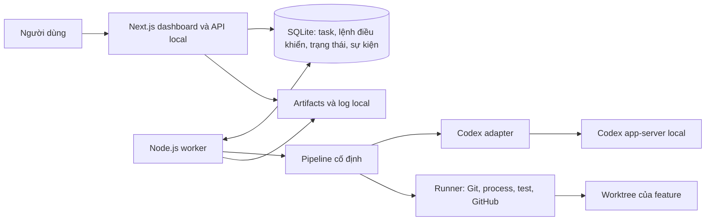

# Agent Harness — thiết kế MVP local

Ngày: 2026-09-23
Trạng thái: thiết kế đã thống nhất qua phỏng vấn; bản spec này chờ người dùng review.

## 1. Mục tiêu và phạm vi

Xây công cụ cá nhân giúp giao một task trên repo có sẵn, làm rõ requirement, duyệt plan, rồi tự code, viết test, review, sửa và bàn giao PR. Mục tiêu là giảm thời gian người dùng phải can thiệp mà vẫn đáp ứng tiêu chí nghiệm thu.

Các quyết định sản phẩm đã chốt:

- Dashboard dùng Next.js, chạy local; một task thực thi tại một thời điểm.
- Nhận repo Git thuộc bất kỳ ngôn ngữ/framework nào. Không giới hạn repo đích ở Next.js.
- Tự đọc repo để giải quyết task người dùng giao; không tự tìm việc để làm.
- Pipeline có stage cố định, không có trình kéo thả workflow trong MVP.
- Dùng Codex làm coding agent, ưu tiên đăng nhập ChatGPT với quyền truy cập sẵn có.
- Người dùng duyệt requirement, plan, tiêu chí nghiệm thu và phạm vi test trước khi code.
- Mỗi feature/task có branch và worktree riêng; reviewer có phiên Codex riêng.
- Người dùng chọn model và reasoning effort theo stage; hệ thống không tự đổi model.
- Viết test cho tính năng mới và bug đang sửa; có thể bỏ qua test cũ ngoài phạm vi feature.
- Tối đa ba vòng sửa tự động sau lần triển khai đầu; hết giới hạn thì cần người dùng quyết định.
- Tạo GitHub PR khi đạt điều kiện; bàn giao local nếu remote không được hỗ trợ hoặc không có remote.
- Không tự merge, deploy hoặc xóa worktree trong MVP.

Các lựa chọn kỹ thuật cụ thể dưới đây là đề xuất triển khai cho những quyết định trên và thuộc phạm vi review bản spec này.

## 2. Kiến trúc đề xuất

- **Web:** Next.js + TypeScript. Nhập task, duyệt plan, xem timeline/diff/test/review và điều khiển pause/resume/cancel. API lưu yêu cầu điều khiển; không giữ agent chạy trong vòng đời HTTP request.
- **Worker:** tiến trình Node.js + TypeScript độc lập với web. Đọc yêu cầu từ database, chiếm quyền chạy một task, thực thi pipeline, ghi sự kiện và kết quả.
- **Persistence:** SQLite lưu dữ liệu có cấu trúc; filesystem lưu báo cáo, log lớn và ảnh/trace E2E. Đây là lựa chọn thiết kế phù hợp phạm vi một người dùng local, không yêu cầu dịch vụ database riêng.
- **Codex adapter:** giao tiếp app-server, cung cấp lấy danh sách model, bắt đầu/tiếp tục/ngắt lượt, nhận sự kiện và chuyển yêu cầu quyền hạn sang dashboard. Không trộn protocol Codex vào logic chuyển trạng thái.
- **Runner:** thực thi các lệnh đã được xác định cho repo, lấy exit code và báo cáo thật. Kết quả test không do lời khẳng định của model quyết định.
- **UI cập nhật:** đọc snapshot và sự kiện có sequence tăng dần; MVP dùng polling theo cursor. Đóng tab không dừng worker.

Chọn pipeline cố định vì có thể kiểm tra chính xác khi nào được code, retry, chờ người dùng hoặc tạo PR. Không dùng một agent toàn quyền tự chọn mọi bước; không xây workflow engine tùy biến ở MVP.

## 3. Repo discovery và môi trường

Người dùng nhập/chọn đường dẫn local đến repo Git, cấu hình base branch và remote. Hệ thống xác thực đường dẫn và branch tồn tại trước khi nhận task.

Discovery đọc hướng dẫn repo, manifest, lockfile, cấu trúc source, scripts, CI và cấu hình test. Kết quả là Repo Profile có:

- Repo root, commit đã đọc, các ngôn ngữ và khu vực chức năng.
- Lệnh setup/build/test, thư mục chạy lệnh, prerequisites và đường dẫn file làm căn cứ.
- Những điều chưa xác định được; không biến suy đoán thành cấu hình chạy chắc chắn.

Không đưa toàn bộ repo vào mỗi prompt. Lưu bản đồ tổng quan gắn với revision; mỗi task đọc sâu vùng liên quan. Khi branch/commit thay đổi, kiểm tra lại phần thông tin bị ảnh hưởng.

Hỗ trợ đa ngôn ngữ thông qua command specification: executable, arguments, cwd, biến môi trường được cho phép, timeout và đường dẫn báo cáo. Không hard-code mọi repo phải dùng npm hoặc cùng test runner. Khi không xác định được command đáng tin cậy, đề xuất command để người dùng xác nhận trong plan.

Máy thiếu runtime/database/service thì chuyển sang chờ thiết lập. Có thể cài project dependencies trong môi trường riêng theo plan; cài runtime hoặc thay đổi cấu hình hệ thống cần người dùng duyệt. Không tự thực thi script chỉ để đọc cấu trúc repo.

Không đọc nội dung secret vào context hay log. Credentials dùng cho môi trường test được truyền riêng khi cần, không ghi vào tài liệu kế hoạch.

## 4. Requirement và kế hoạch thực thi task

Stage phân tích kết hợp task với Repo Profile, sau đó hỏi người dùng những quyết định nghiệp vụ không thể suy ra từ code. Requirement mơ hồ khiến task chờ câu trả lời, không tự chọn hành vi sản phẩm.

Plan có phiên bản, bao gồm:

1. Mục tiêu và những gì ngoài phạm vi.
2. Tiêu chí nghiệm thu có ID ổn định.
3. Khu vực code dự kiến thay đổi, dependencies mới và yêu cầu môi trường.
4. Branch nguồn, commit nguồn và branch đích PR.
5. Test plan: từng kiểm tra, loại unit/integration/E2E, command, prerequisites, tiêu chí nghiệm thu được kiểm chứng.
6. Model/effort dự kiến cho từng stage AI và giới hạn vòng sửa.

Approval gắn với phiên bản plan và phạm vi công việc. Thay requirement, tiêu chí nghiệm thu, dependency hoặc mở rộng phạm vi làm mất hiệu lực approval cũ; trình phần thay đổi rồi chờ duyệt lại. Chi tiết triển khai trong phạm vi đã duyệt do agent tự quyết.

## 5. Pipeline và trạng thái

Tách **stage** (đang làm công việc gì) khỏi **status** (công việc đang chạy hay phải chờ). Cách này tránh nhân đôi trạng thái cho mọi nguyên nhân gián đoạn.

Stages: `discover`, `analyze`, `plan`, `prepare`, `implement`, `verify`, `review`, `repair`, `deliver`.

Statuses: `queued`, `running`, `waiting_input`, `waiting_approval`, `blocked`, `paused`, `interrupted`, `completed`, `cancelled`, `failed`.

Mỗi trạng thái chờ có reason và hành động cần thiết; ví dụ `quota`, `environment`, `model_unavailable`, `repair_limit`, `test_failure`, `delivery_error`.

| Stage | Đầu ra và điều kiện chuyển tiếp |
| --- | --- |
| discover | Repo Profile và kiểm tra khả năng thực thi → analyze |
| analyze | Requirement đủ rõ; thiếu thông tin → waiting_input; đủ → plan |
| plan | Plan có phiên bản → waiting_approval; được duyệt → prepare |
| prepare | Tạo mới hoặc xác minh worktree/branch đã có, môi trường đủ và dependencies được duyệt → implement lần đầu hoặc repair nếu đang sửa |
| implement | Code và test cho tính năng mới/bug → verify |
| verify | Kiểm tra bắt buộc pass → review; lỗi do thay đổi → repair; lỗi môi trường → blocked |
| review | Không còn finding bắt buộc sửa, đủ bằng chứng → deliver; có finding → repair |
| repair | Sửa theo lỗi test/review, tăng repair round → verify; thay phạm vi → plan |
| deliver | Kiểm tra evidence còn hiệu lực, commit/push/tạo PR hoặc xuất bàn giao local → completed |

`paused`, `interrupted`, `blocked` giữ stage hiện tại và lần chạy cuối. Resume phải qua bước đối chiếu thực tế trước khi xác định stage tiếp tục. `failed` dành cho lỗi không thể phục hồi của lần chạy, không dùng thay cho chờ hạn mức/môi trường.

Khi quay lại plan giữa vòng sửa, giữ worktree, branch và repair count. Duyệt plan mới không tạo implementation đầu tiên lần thứ hai và không tự cấp thêm vòng sửa.

Mỗi task có nhiều Stage Attempt. Một attempt lưu đầu vào, model/effort thực dùng, phiên Codex, thời điểm, status, revision và output. Sự kiện cũ không được sửa để che một attempt thất bại.

## 6. Model và context

Các stage `discover`, `analyze`, `plan`, `implement`, `review`, `repair` có cấu hình model/effort riêng. Viết test nằm trong implement/repair. Verify chạy command; prepare/deliver dùng công cụ, không cần một model riêng để xác định kết quả.

- Thứ tự ưu tiên: cấu hình stage của task → cấu hình stage mặc định của hệ thống → model/effort mặc định hiện có từ Codex.
- Khi tạo task, sao chép cấu hình mặc định vào task; chụp cấu hình thực dùng thành snapshot khi bắt đầu attempt. Thay setting chung không âm thầm đổi task đã tạo.
- Danh sách model và effort lấy từ runtime/tài khoản; kiểm tra cặp lựa chọn hợp lệ trước khi chạy.
- Model không khả dụng: báo và chờ người dùng chọn lại. Không tự fallback.
- Thay model có hiệu lực ở lượt sau. Muốn đổi ngay phải ngắt lượt đang chạy, chờ nó dừng, đối chiếu file/process rồi tiếp tục.
- Model mới nhận requirement/plan đã duyệt, diff hiện tại, finding và kết quả kiểm tra liên quan. Không phụ thuộc vào trí nhớ ngầm giữa hai phiên.
- Reviewer dùng phiên riêng với quyền chỉ đọc code; output có cấu trúc gồm finding, severity, file/căn cứ, tiêu chí bị vi phạm và verdict.
- Log hiển thị model/effort thực dùng, thời gian, usage khi runtime cung cấp. Không tự quy đổi usage thành USD của subscription.

Gói được người dùng mô tả là 25 USD/tháng chưa xác định được tên gói/hạn mức cụ thể. Tích hợp cần kiểm chứng đăng nhập, catalog model và một lượt read-only với tài khoản thực trước khi xây đầy đủ pipeline. Không tự chuyển sang API tính phí.

## 7. Branch, worktree và revision

- Một task tương ứng một feature hoặc bug nhỏ. Task có nhiều feature độc lập phải được chia trước khi duyệt plan.
- Mặc định tạo branch `codex/<task-id>-<slug>` từ commit đã chốt của base branch. Tên va chạm phải được xử lý mà không chiếm branch của task khác.
- Cho phép branch nguồn là feature khác; lưu dependency và chọn branch đích PR phù hợp. Không tự rebase/merge khi branch nguồn thay đổi.
- Mỗi task có worktree riêng. Không checkout branch khác trong working directory đang dùng của người dùng; không tự mang thay đổi chưa commit từ đó sang task.
- Discovery và plan phải gắn với revision nguồn. Nếu source thay đổi trước prepare, đọc lại phần bị ảnh hưởng và xin duyệt lại khi plan phải thay đổi.
- Resume và mọi vòng sửa giữ nguyên branch/worktree. Reviewer đọc cùng snapshot nhưng không ghi vào đó.
- Kết quả test/review gắn với snapshot fingerprint của source và cấu hình liên quan, kể cả file mới chưa commit. Bất kỳ thay đổi code sau kiểm tra làm evidence tương ứng hết hiệu lực.
- Worktree tách Git state, không được coi là sandbox bảo mật. Quyền chạy agent/process vẫn do policy thực thi giới hạn.

## 8. Chính sách test và review

Chính sách cuối cùng theo yêu cầu người dùng: chỉ bắt buộc kiểm chứng tính năng/bug hiện tại; có thể bypass test cũ ngoài phạm vi. Không có gate yêu cầu toàn bộ legacy suite pass.

- Viết test mới cho feature mới và test hồi quy cho bug đang sửa. Không bổ sung coverage hàng loạt cho code cũ.
- Test cũ trực tiếp kiểm chứng feature hiện tại có thể được đưa vào Test Plan; legacy test ngoài phạm vi được ghi rõ là không chạy.
- Unit/integration/E2E là các khả năng của harness. Mỗi task chọn loại test cần thiết trong plan, không bắt mọi thay đổi phải có cả ba.
- Nếu thiếu test tooling, đưa setup tối thiểu và dependencies vào plan đã duyệt.
- Kết quả phân biệt `passed`, `failed`, `blocked`, `skipped`, `not_applicable`. Bỏ qua test không được chuyển thành pass.
- Test bắt buộc của feature phải pass. Không tự bỏ một test bắt buộc sau khi thấy fail; thay phạm vi kiểm tra cần duyệt plan mới và phải lưu lý do.
- Nếu test không thể tách khỏi lỗi cũ, trước hết đề xuất cách chọn phạm vi phù hợp. Nếu lỗi cũ vẫn ngăn chứng minh feature đúng, báo blocked thay vì tuyên bố thành công.
- Unit/integration có thể mock theo plan. E2E chạy luồng đã duyệt trong môi trường test; thiếu account/service/credentials thì blocked, không tự thay bằng mock.
- Runner ghi command, exit code, timeout, test count nếu lấy được, báo cáo và revision. Exit code 0 nhưng không có bằng chứng các test yêu cầu đã được tìm thấy/chạy không đủ để pass.
- AI không được skip/xóa assertion chỉ để làm test xanh. Reviewer kiểm tra nội dung test với tiêu chí nghiệm thu và ghi nhận mọi thay đổi test.

Reviewer chỉ yêu cầu sửa các lỗi có căn cứ về requirement, tính đúng đắn, bảo mật hoặc quy ước bắt buộc của repo. Góp ý sở thích/style không liên quan không kéo dài vòng sửa. Test runner pass không thay thế việc đáp ứng requirement; reviewer nói pass cũng không thay thế kết quả runner.

## 9. Giới hạn, pause và recovery

Sau implementation đầu tiên, tối đa ba vòng repair cho toàn task. Fail verify và finding review dùng chung bộ đếm; đổi model hoặc restart worker không đặt lại số vòng. Hết ba vòng → blocked với diff, finding còn lại và lựa chọn cho người dùng cấp thêm vòng hoặc dừng.

Mặc định đề xuất: timeout 30 phút cho một lượt AI, 15 phút cho một command ngắn hạn; có thể chỉnh trong cấu hình task/plan. Dịch vụ test dài hạn dùng readiness timeout và vòng đời process riêng. Timeout làm task dừng chờ xem xét, không tự tạo chuỗi retry vô hạn. Mất kết nối điều khiển không đồng nghĩa tiến trình đã dừng.

- Pause ngắt lượt/lệnh đang chạy, xác nhận tiến trình đã dừng và lưu tiến độ. Cancel dừng task nhưng giữ code và artifacts.
- Worker dùng task lease và fencing token; attempt cũ không được cập nhật kết quả sau khi mất quyền sở hữu.
- Ghi intent trước side effect; ghi kết quả sau khi xác nhận. Chuyển trạng thái và append event trong cùng transaction.
- Khi khởi động lại, task đang running được đánh dấu cần reconciliation: kiểm tra phiên Codex, PID/process identity, worktree và effect đã tạo.
- Nếu không thể xác định process cũ đã dừng, không khởi chạy agent ghi file thứ hai vào cùng worktree.
- Người dùng bấm Tiếp tục sau crash hoặc hết quota; hệ thống xác nhận checkpoint và chọn bước cần chạy lại.
- Lệnh commit/push/tạo PR phải đối chiếu trạng thái thực trước retry. Không hứa exactly-once cho side effect bên ngoài.
- Đóng tab/dashboard không giết worker; tắt máy hoặc dừng worker thì task bị gián đoạn. MVP chưa cài dịch vụ hệ điều hành tự khởi động.

## 10. Điều kiện bàn giao

Được chuyển sang deliver khi:

1. Plan hiện tại được duyệt và không có scope change đang chờ.
2. Mỗi tiêu chí nghiệm thu có bằng chứng đạt yêu cầu.
3. Các kiểm tra bắt buộc của feature pass trên snapshot cuối.
4. Reviewer không còn finding bắt buộc sửa trên snapshot đó.
5. Diff cuối nằm trong phạm vi và không có thay đổi ngoài kiểm soát sau verify/review.

Deliver tạo commit chứa phần thay đổi của task, push branch và mở PR vào target đã lưu. Báo cáo gồm mục tiêu, thay đổi, tiêu chí nghiệm thu, kết quả test, legacy tests bị bỏ qua, giới hạn, finding và quan hệ feature phụ thuộc.

GitHub error/auth thiếu thì giữ trạng thái blocked tại deliver và cho retry hoặc chọn bàn giao local. Repo không có remote hỗ trợ được bàn giao local ngay theo mode đã chọn. `completed` phải ghi delivery mode và PR URL hoặc đường dẫn artifact; không đồng nghĩa đã merge hay deploy.

PR được đối chiếu bằng repo/head/base và task marker để tránh tạo trùng sau mất kết nối. Nếu đã có PR thì dùng lại; nếu push thành công nhưng response bị mất thì xác minh remote head trước retry. Không force-push để giải quyết xung đột ngoài ý muốn.

## 11. Dữ liệu và giao diện MVP

Các thực thể chính:

| Thực thể | Nội dung |
| --- | --- |
| Repository / RepoProfile | Path, base/remote, commit, công nghệ, command candidates và căn cứ |
| Task | Requirement, stage/status/reason, branch/worktree, dependency, repair count, delivery mode |
| PlanVersion / Approval | Phạm vi, tiêu chí, test plan, cấu hình và phiên bản được duyệt |
| StageAttempt | Phiên Codex, snapshot cấu hình, input/output, thời điểm, revision, usage |
| CheckResult / ReviewFinding | Bằng chứng test, finding và vòng sửa xử lý |
| Event / ControlCommand | Timeline có thứ tự; lệnh pause/resume/cancel có ID chống lặp |
| SideEffect / Artifact | Intent/result của tác động ngoài DB; đường dẫn và fingerprint báo cáo |

Các màn hình: danh sách repo/task; tạo task; hỏi đáp và duyệt plan; chi tiết task với timeline, diff, tests, review; cấu hình model theo stage; kết quả bàn giao. Task detail thể hiện rõ đang chạy/chờ gì, người dùng cần làm gì và trạng thái worker.

Web và worker chỉ lắng nghe loopback. Mutation endpoint kiểm tra origin/session local; không mở quyền thực thi local ra mạng. Credential không gửi đến browser hoặc lưu trong database/log. Repository-controlled content không được thay policy, approval hoặc giới hạn của harness.

## 12. Kiểm chứng harness và thứ tự xây

Các lát cắt triển khai dự kiến, mỗi lát có kết quả quan sát được:

1. **Kết nối và discovery:** kiểm chứng Codex auth/model/read-only run; nhập repo; hiển thị profile, prerequisites và model catalog.
2. **Requirement và approval:** tạo task, hỏi đáp, lưu plan version và ngăn code trước approval.
3. **Thực thi feature:** branch/worktree, một lượt implement, chạy test theo plan và xem bằng chứng trên dashboard.
4. **Vòng review/sửa:** reviewer độc lập, finding có cấu trúc, repair limit và evidence bị vô hiệu khi code đổi.
5. **Phục hồi và bàn giao:** pause/crash/quota/resume, effect reconciliation, GitHub PR không trùng và fallback local.

Đây là thứ tự xây ở mức thiết kế; implementation plan chi tiết sẽ tách thành các việc có file, dependency và cách kiểm chứng sau khi bản spec được review.

Kiểm thử chính harness gồm:

- Unit: transition guards, approval theo version, giới hạn repair, cấu hình model và invalidation evidence.
- Integration: SQLite transaction/lease, Codex adapter với event giả lập, Git worktree thật trong repo tạm, process exit/timeout, reconciliation GitHub qua adapter giả lập.
- E2E dashboard: tạo task → duyệt → code → verify fail → repair → review → deliver; pause/resume; thay model; thiếu runtime; quota; legacy test fail ngoài phạm vi không chặn feature; required test bị skip phải chặn.
- Live smoke có kiểm soát: một repo frontend và một repo ngôn ngữ khác, dùng runtime có trên máy và tài khoản Codex thật. Kết quả chỉ xác nhận các môi trường được thử, không tuyên bố mọi stack đều đã kiểm chứng.
- Fault injection: worker chết sau side effect nhưng trước khi ghi kết quả; mất kết nối khi agent còn chạy; hai worker tranh lease; code đổi sau verify; PR tạo xong nhưng response mất.

Theo dõi thời gian người dùng can thiệp, số lần hỏi lại, số vòng sửa, thời gian hoàn thành và tỉ lệ task được chấp nhận mà không cần sửa tay. MVP lưu dữ liệu để đo; chưa đặt một ngưỡng cải thiện không có baseline.

## 13. Nguồn kỹ thuật

Đã kiểm tra tài liệu ngày 2026-09-23. Các thông số account/model được đọc lại từ runtime khi chạy.

- [Codex authentication](https://learn.chatgpt.com/docs/auth): đăng nhập ChatGPT cho subscription hoặc API key cho usage-based access.
- [Codex non-interactive mode](https://learn.chatgpt.com/docs/non-interactive-mode): tái dùng CLI authentication, output và cấu hình chạy script.
- [Codex app-server](https://learn.chatgpt.com/docs/app-server): model catalog, override model/effort theo lượt, events và approvals. Đây là adapter đề xuất cho dashboard có tương tác.
- [Codex SDK](https://learn.chatgpt.com/docs/codex-sdk): lựa chọn thay thế cho automation đơn giản; không triển khai đồng thời cả hai adapter trong MVP.
- [Next.js self-hosting](https://nextjs.org/docs/app/guides/self-hosting): cơ sở chạy web server local.
- [SQLite appropriate uses](https://www.sqlite.org/whentouse.html): cơ sở chọn lưu trữ ứng dụng local.
