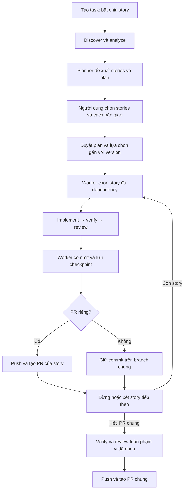

# Story picker và delivery theo story

Trạng thái: người dùng duyệt ngày 2026-10-06; triển khai theo plan cùng ngày.

## Mục tiêu và quyết định đã thống nhất

Người dùng nhập feature, Harness đề xuất các story có point và dependency, người dùng chọn phạm vi thực hiện. Hỗ trợ cả PR riêng từng story và một PR cho toàn bộ stories đã chọn. Chạy tuần tự; mặc định dừng sau mỗi story, cho phép tiếp tục tự động những story đã chọn. Giữ kết quả đã hoàn thành khi story sau bị gián đoạn. Không dự báo token, quota hay USD trong feature này.

Đây là phần mở rộng của `2026-09-23-agent-harness-design.md`, không thay thế các gate về plan approval, test, review, worktree, reconciliation và delivery. Chỉ coi phần mở rộng là requirement sau khi được người dùng duyệt.

## Luồng và trách nhiệm

| Thành phần | Trách nhiệm |
| --- | --- |
| Planner | Đề xuất story có kết quả độc lập, point và mapping vào plan; không tự chọn thay người dùng |
| UI/API | Hiển thị lựa chọn, dependency, point; gửi lựa chọn có version/revision |
| Worker | Kiểm tra lựa chọn, dependency, approval; chạy tuần tự, lưu checkpoint và điều phối delivery |
| Implement/repair agent | Chỉ sửa phạm vi story hiện hành hoặc finding của lượt tổng hợp |
| Runner/reviewer | Chứng minh từng story và kiểm tra lại snapshot cuối của feature chung PR |
| Delivery | Commit/push/PR có intent và xác nhận; retry không tạo trùng |

## Tương thích và kích hoạt

Thêm `splitIntoStories?: boolean` vào input tạo task; thiếu hoặc false giữ luồng task hiện tại. Khi true, planner trả trường `stories` trong PlanVersion. Các task/plan cũ vẫn parse được và không bị chuyển thành feature tự động.

Task gốc là feature coordinator. Với PR riêng, tạo task con cho từng story đã chọn. Với PR chung, task gốc thực thi từng story trên cùng worktree/branch. UI task gốc hiển thị tiến độ feature và link tới task con nếu có.

## Contract và validation

`Story` gồm `id`, `title`, `outcome`, `points: 1 | 2 | 3 | 5 | 8`, `dependsOn: string[]`, `criterionIds: string[]`, `stepIds: string[]`. Check và screenshot được lấy từ mapping criterion/check trong plan; không lưu bản sao command có thể lệch với plan.

Mỗi story phải có criterion và step tồn tại; mọi criterion và step của plan chia story phải thuộc đúng một story. Các step dependency giữa story phải có quan hệ dependency tương ứng. Check có thể phục vụ nhiều story, nhưng được chạy lại theo snapshot hiện hành. Screenshot chỉ được chọn khi đủ các criterion liên quan trong story hoặc lượt verify tổng hợp.

Chặn ID trùng, dependency không tồn tại, self dependency, cycle, mapping thiếu/trùng, chọn rỗng hoặc chọn ID không tồn tại. Story 8 point hiển thị khuyến nghị tách; không tự chia bằng heuristic và không cấm người dùng chọn story 8 point.

`StorySelection` gồm `planVersion`, `storyIds`, `mode: separate_pr | shared_pr`, `continueAutomatically: boolean` (mặc định false). Muốn chọn story phải chọn toàn bộ dependency của nó; UI giải thích story nào còn thiếu, server kiểm tra lại. Thứ tự thực thi là topological order, tie-break theo thứ tự planner đề xuất. Không dùng story point để suy ra phần trăm usage.

Selection được gửi trong command approve và persist trong cùng transaction với approval. Mode và phạm vi story bị khóa sau khi bắt đầu implement. Replan trước implement làm mất hiệu lực selection/approval; yêu cầu chọn và duyệt version mới. Replan giữa thực thi giữ checkpoint, worktree và repair count; thay phạm vi story đã hoàn thành bị chặn cho đến khi người dùng quyết định một task thay đổi riêng. Không âm thầm xóa checkpoint.

## Lưu trạng thái và evidence

Thêm record `story-run`, khóa `featureId:planVersion:storyId`, gồm state `pending | running | completed | interrupted | blocked`, childTaskId nếu có, baselineCommit, commit, checkpointPath và timestamp. State hiển thị dựa trên evidence thực tế, không dựa trên lời agent.

Checkpoint JSON chứa story ID, plan version/hash, baseline và commit, fingerprint, check/review references, kết quả delivery nếu có. Lưu file rồi persist record xác nhận; recovery đối chiếu HEAD và effect marker trước retry. Chỉ chuyển completed sau test/review pass và commit đã xác nhận. PR riêng cần delivery PR/local đã xác nhận nữa. Story chung PR completed là milestone cục bộ; UI ghi rõ feature chưa bàn giao.

Evidence và attempt mới có storyId (nullable cho task cũ/lượt tổng hợp), planVersion và baseline. Giữ record lịch sử theo story; record checks/review hiện hành vẫn có thể dùng cho luồng stage nhưng phải đối chiếu storyId trước chuyển stage. Task detail trả danh sách story và checkpoint đã xác nhận.

## PR riêng từng story

Worker tạo task con và liên kết idempotently bằng feature/version/story. Task con giữ pipeline đầy đủ và plan approval; plan con được tạo từ mapping đã duyệt, không gọi planner để tự thay requirement. Nếu source commit thay đổi sau dependency được tích hợp, chạy discover/plan và duyệt lại như pipeline hiện tại yêu cầu.

Dependency GitHub chỉ đủ khi commit story trước là ancestor của target branch mới fetch. Trường hợp squash/rebase merge không chứng minh bằng ancestry được thì blocked với lý do, người dùng duyệt replan trên base mới; không coi PR đã mở là dependency đã tích hợp. Không tự merge PR.

Với local delivery, story phụ thuộc chờ commit có trong target branch của repo đích; người dùng tự tích hợp. Story độc lập không cần chờ merge của story khác. Mặc định dừng sau mỗi task con hoàn thành. `continueAutomatically` chỉ chạy tiếp story đủ dependency, không bypass approval hoặc điều kiện tích hợp.

## Một PR cho toàn feature

Dùng worktree/branch của task gốc. Story đầu lấy sourceCommit đã duyệt làm baseline; story sau lấy commit checkpoint trước. Worker tạo plan thực thi được project từ feature plan vào story hiện hành, không mutate PlanVersion đã duyệt. Scope/fingerprint/check/review gate của story dùng baseline riêng; scope cuối dùng baseline feature và toàn bộ files đã chọn.

Sau test/review pass, commit story rồi chuyển sang story tiếp theo hoặc paused với reason `story_checkpoint`. Không push hoặc tạo PR tại checkpoint. Lịch sử commit/effect dùng storyId và fingerprint để tránh đụng key của delivery cuối.

Sau story cuối, verify toàn bộ required checks thuộc stories đã chọn trên cùng snapshot cuối; review toàn diff so với feature baseline. Bất kỳ failure nào đưa vào repair với phạm vi đã duyệt và giữ lịch sử story. Chỉ deliver khi evidence cuối còn hiệu lực. Report chung liệt kê từng story, checkpoint và kết quả tổng hợp; tránh coi report story cũ là bằng chứng pass của snapshot cuối.

Repair count của task gốc không reset khi đổi story hay replan. Theo cập nhật đã duyệt ngày 2026-10-07, task con PR riêng có repair count riêng và không giới hạn số vòng. Retry dùng lại task con hiện có để giữ lịch sử và tránh chạy trùng.

## Pause, resume và lỗi

Checkpoint boundary pause không ngắt process vì agent đã terminal. Pause giữa story dùng cơ chế stop/reconciliation hiện có. Resume không chạy lại story completed, không mở task ghi thứ hai trong cùng worktree, không tạo trùng commit/PR. Không đảm bảo quota đủ cho một story và không tự chạy lại vô hạn khi hết quota.

Task gốc separate_pr completed khi mọi story đã chọn có delivery xác nhận; PR còn chưa merge vẫn có thể là delivery của story cuối, nhưng dependency của story sau bắt buộc được tích hợp. Chưa chọn hoặc không thể chạy thì hiển thị waiting/blocked cùng hành động cần thiết.

## UI

Form tạo task có checkbox chia story. Trang duyệt plan có danh sách stories: checkbox, outcome, point, dependency và tiêu chí; chọn mode bằng radio; checkbox tiếp tục tự động mặc định tắt. Nút duyệt bị vô hiệu khi selection thiếu dependency, nhưng backend vẫn validation độc lập.

Trang task hiển thị story đang chạy, stories đã hoàn thành, checkpoint commit, link task con/PR khi có, lý do chờ dependency và nút tiếp tục ở boundary. Các story chưa chọn ghi rõ ngoài phạm vi lượt chạy. Không hiển thị JSON kỹ thuật làm luồng lựa chọn chính.

## Tiêu chí nghiệm thu

1. Task cũ và task không bật split giữ pipeline cũ.
2. Planner tạo stories; validation từ chối cycle/ID/mapping/selection không hợp lệ.
3. Người dùng chọn stories, mode và chính sách tiếp tục; stale approval bị từ chối.
4. PR riêng: đúng một task/branch/delivery mỗi story, dependency chỉ mở sau tích hợp đã xác minh.
5. PR chung: cùng branch, từng story có commit và checkpoint; không PR ở checkpoint; final verify/review toàn phạm vi đã chọn rồi mới PR.
6. Dừng mặc định sau mỗi story; bật tự động vẫn giữ mọi gate.
7. Crash/retry ở commit hoặc PR không tạo trùng; resume không chạy lại story completed.
8. Evidence lỗi hoặc cũ không thể đánh dấu completed; test feature bắt buộc không được bỏ qua.

## Ngoài phạm vi

Quota estimator, dashboard usage, tự merge/deploy, chạy stories song song, đổi mode giữa implement, thêm provider, sửa unrelated UI, bổ sung hàng loạt tests legacy.
